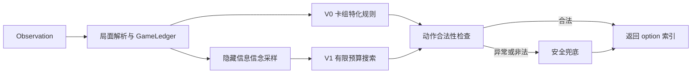

# Pokémon TCG AI Battle Agent

这是一个面向 **Pokémon TCG AI Battle Challenge** 的卡牌对战智能体项目。项目从稳定、低延迟的卡组特化规则策略出发，逐步加入局面解析、隐藏信息信念采样、有限预算搜索、卡牌知识库、卡组优化和轻量策略蒸馏，并配套本地对战、联赛评估、坏例回放和提交包冻结工具。

当前推荐的正式提交物是：

```text
final_submissions/submission_flat_safe_v0.zip
```

该版本是针对 Kaggle raw `exec` 运行方式构建的单文件规则策略，稳定、轻量且不依赖训练模型。搜索版和蒸馏版均保留为实验产物，默认不替换正式提交。

## 项目状态

| 版本 | 定位 | 当前状态 |
| --- | --- | --- |
| Flat Safe V0 | 卡组特化规则 + 安全兜底 | 推荐主提交 |
| Multi-module V0 | 模块化规则策略 | 本地开发与备份 |
| Search V1 | 信念采样 + 有限预算搜索 | 实验版，默认关闭 |
| Distill V2 | NumPy 线性 policy/value/risk 模型 | 管线已跑通，未晋级 |
| M5 Elite Decks | MAP-Elites 卡组候选 | 候选池，未替换主卡组 |

最终冻结报告位于 `reports/final_freeze_report.json`。详细的阶段结论可参考根目录下的 `M0_交付说明.md` 至 `M6_小模型蒸馏说明.md`，以及 `FINAL_收尾交付说明.md`。

## 核心工作流



Kaggle 入口为 `submission/main.py` 中的：

```python
def agent(obs_dict):
    ...
```

- `agent(None)` 或初始无选择请求时返回 `deck.csv` 中的 60 张卡牌 ID。
- 常规回合先解析 observation，再尝试搜索或规则策略。
- 所有策略输出都会经过合法性检查；解析、搜索或规则发生异常时回退到安全动作。
- V1 搜索默认关闭，因此日常运行仍采用 V0 规则策略。

## 目录结构

```text
.
├── submission/                 # 当前模块化智能体与官方 cg 运行库
│   ├── main.py                 # agent(obs_dict) 入口
│   ├── deck.csv                # 当前 60 张主卡组
│   ├── agent/                  # 解析、规则、belief、搜索、估值与兜底
│   └── cg/                     # 对战引擎 Python 接口及跨平台动态库
├── eval/                       # 单场批量评估、联赛、统计与坏例回放
├── src/
│   ├── cards/                  # 卡牌数据库、标签、卡组规则与优化器
│   └── train/                  # 蒸馏数据、特征、训练与 reanalysis
├── tests/                      # 回归、战术、搜索、卡组和蒸馏测试
├── scripts/                    # Flat 提交包构建与最终冻结
├── jobs/                       # Slurm 批处理脚本
├── data/                       # 卡牌数据、候选卡组及蒸馏数据
├── models/                     # 实验性轻量模型
├── experiments/               # 历史对局结果与联赛报告
├── logs/bad_cases/             # 可回放的失败对局
├── final_submissions/          # 冻结目录及 zip 提交包
└── reports/                    # 最终冻结报告
```

`experiments/`、`logs/` 和 `final_submissions/` 中包含较多历史产物及提交副本；研发主线代码集中在 `submission/`、`eval/`、`src/`、`scripts/` 和 `tests/`。

## 环境要求

- Python 3.11 或更高版本；项目当前产物也在 Python 3.13 环境中使用过。
- NumPy：仅蒸馏训练和 reanalysis 需要。
- pytest：推荐用于一次性执行全部测试。
- CPU 即可；当前正式提交、回归评估和线性蒸馏均不要求 GPU。

建议创建独立环境：

```bash
conda create -n pokemon-tcg python=3.11 -y
conda activate pokemon-tcg
pip install numpy pytest
```

请始终从项目根目录执行下文命令。`submission/cg/` 已包含 Windows、Linux、macOS 和 Linux ARM64 对应的动态库，加载逻辑会根据当前平台选择文件。

## 快速开始

### 1. 验证对战引擎

```bash
python submission/test_sim.py
```

### 2. 运行规则智能体对随机基线

```bash
python eval/run_match.py --agent0 submission --agent1 random --games 100
```

结果默认写入：

```text
experiments/YYYYMMDD_HHMMSS_submission_vs_random/
├── games.json
└── summary.json
```

常用评估方式：

```bash
# 镜像对局
python eval/run_match.py --agent0 submission --mirror --games 100

# 与 first-min 弱规则基线对战
python eval/run_match.py --agent0 submission --agent1 first-min --games 100

# 评估另一个 main.py
python eval/run_match.py --agent0 path/to/main.py --agent1 submission --games 100

# 保存回归 observation 和失败对局
python eval/run_match.py --games 100 --save-fixtures 20 --bad-case-dir logs/bad_cases/manual
```

`summary.json` 包含胜负、平均步数、异常、非法动作、决策耗时及 p95 延迟等指标。

### 3. 执行测试

```bash
pytest -q
```

也可以按交付顺序直接执行各测试脚本：

```bash
python tests/test_regression.py
python tests/test_fallback.py
python tests/test_m3_search.py
python tests/test_card_db.py
python tests/test_tactics.py
python tests/test_deck_optimizer.py
python tests/test_distill_pipeline.py
python tests/test_flat_submission.py
```

## 评估与分析

### 固定基线联赛

```bash
python eval/league.py --candidate submission --games 500
```

默认对手为 `Random`、`Sample` 和 `Exploiter-FirstMin`。如果本地没有项目所引用的官方 Sample 路径，可显式限制为仓库内可用基线：

```bash
python eval/league.py --candidate submission --games 500 --baselines Random,Exploiter-FirstMin
```

### 统计晋级判断

```bash
python eval/stats.py experiments/<run>/summary.json --baseline-win-rate 0.5
```

脚本使用 Wilson 95% 区间，并结合异常、非法动作、样本量和相对基线提升给出“晋级 / 观察 / 淘汰”结论。

### 回放失败用例

```bash
python eval/replay_case.py logs/bad_cases/<case>.json --agent submission
```

`--agent` 可以重复指定，用于比较多个策略在同一局面上的选择。

## 启用 V1 搜索

模块化入口的搜索由环境变量控制，默认关闭：

```bash
PTCG_ENABLE_SEARCH=1 python eval/run_match.py --agent0 submission --agent1 random --games 100
```

PowerShell 写法：

```powershell
$env:PTCG_ENABLE_SEARCH = "1"
python eval/run_match.py --agent0 submission --agent1 random --games 100
```

可调参数：

| 环境变量 | 默认值 | 含义 |
| --- | ---: | --- |
| `PTCG_SEARCH_CANDIDATES` | 6 | 最大候选动作数 |
| `PTCG_SEARCH_PARTICLES` | 3 | belief 粒子数 |
| `PTCG_SEARCH_NODE_BUDGET` | 64 | 节点预算 |
| `PTCG_SEARCH_TIME_BUDGET` | 0.035 | 单次搜索时间预算（秒） |
| `PTCG_SEARCH_SWITCH_MARGIN` | 175 | 搜索替换规则动作的分数阈值 |

搜索版需要先通过稳定性、非法动作和耗时检查，再与 V0 做足量对局比较；当前不建议直接替换正式提交。

## 卡牌知识库与卡组优化

生成或刷新卡牌数据库、标签，并检查当前卡组：

```bash
python src/cards/card_db.py
python src/cards/tags.py
python src/cards/deck_rules.py submission/deck.csv
```

运行候选生成与 MAP-Elites 筛选：

```bash
python src/cards/deck_optimizer.py --per-archetype 150
```

主要输出包括：

- `data/cards.json`：统一卡牌数据库；
- `data/card_tags.json`：规则标签；
- `data/deck_candidates.json`：候选与代理评分；
- `data/deck_elites/*.csv`：不同特征格的精英卡组；
- `data/deck_coevolution_plan.json`：后续实战联赛计划。

代理评分只用于缩小候选空间，不能替代真实对局评估。替换 `submission/deck.csv` 前应先检查合法性，再运行固定基线联赛和完整回归测试。

## V2 蒸馏实验

当前蒸馏模型是纯 NumPy 线性 policy/value/risk 模型，产物状态为 `experimental_not_promoted`。

```bash
# 从测试 fixtures 采集 teacher 决策
python src/train/collect_distill.py --max-samples 50 --search

# 训练并导出 JSON 模型
python src/train/train_distill.py

# 生成高价值重分析队列
python src/train/reanalysis.py
```

默认输出位于 `data/distill/`、`models/v2_policy_linear.json` 和 `data/reanalysis_queue.json`。现有数据仅达到 smoke test 规模，不能据此判断模型强于规则或搜索主线。

## 构建与冻结提交包

构建 raw-exec 兼容的 Flat V0 包：

```bash
python scripts/build_flat_submission.py --name safe_v0
```

默认生成：

```text
final_submissions/submission_flat_safe_v0/
final_submissions/submission_flat_safe_v0.zip
```

完整冻结全部候选并生成报告：

```bash
python scripts/freeze_final.py
```

冻结操作会重新生成 `final_submissions/` 中的相关候选及 `reports/final_freeze_report.json`，建议仅在完整测试通过、准备交付时执行。

Flat 包必须满足：

- `main.py` 不依赖 `__file__`；
- `main.py` 不导入 `agent/` 子包；
- zip 根目录直接包含 `main.py`、`deck.csv` 和 `cg/`；
- `agent(None)` 返回恰好 60 个卡牌 ID；
- raw `exec(main_py_code, env)` 和本地回归测试均通过。

## Slurm 作业

`jobs/` 提供各阶段 CPU 评估、联赛、卡牌测试、卡组搜索、蒸馏和最终回归脚本。例如：

```bash
PROJECT_DIR=/path/to/project sbatch jobs/final_regression.slurm
```

其他脚本包括 `m2_league.slurm`、`m3_search_eval.slurm`、`m5_deck_search.slurm` 和 `m6_distill.slurm`。除 `m3_gpu_train_template.slurm` 是预留模板外，当前主流程均可在 CPU 上运行。

## 开发注意事项

- 优先保证动作合法、无异常、无超时，再比较胜率。
- 新策略应保留 V0 规则和 `safe_action` 作为兜底。
- 不要用少量 smoke 对局直接晋级策略或卡组。
- 修改 observation 解析、规则分支或卡组后，至少运行回归、战术和兜底测试。
- 修改搜索后额外运行 `test_m3_search.py`；修改卡组后运行卡组合法性与优化器测试；修改提交构建逻辑后运行 `test_flat_submission.py`。
- 正式上传优先使用已经冻结和复验的 `submission_flat_safe_v0.zip`。

## 进一步阅读

- `执行文档.md`：完整阶段规划与技术路线。
- `M1_卡组策略说明.md`：V0 卡组特化规则。
- `M2_评估系统说明.md`：评估纪律、统计指标和晋级规则。
- `M3_搜索系统说明.md`：belief 与有限预算搜索设计。
- `M4_卡牌知识库与战术测试说明.md`：卡牌数据和战术测试。
- `M5_卡组优化与协同进化说明.md`：MAP-Elites 与卡组候选。
- `M6_小模型蒸馏说明.md`：数据 schema、模型与 reanalysis。
- `FINAL_收尾交付说明.md`：最终冻结结论和提交建议。
