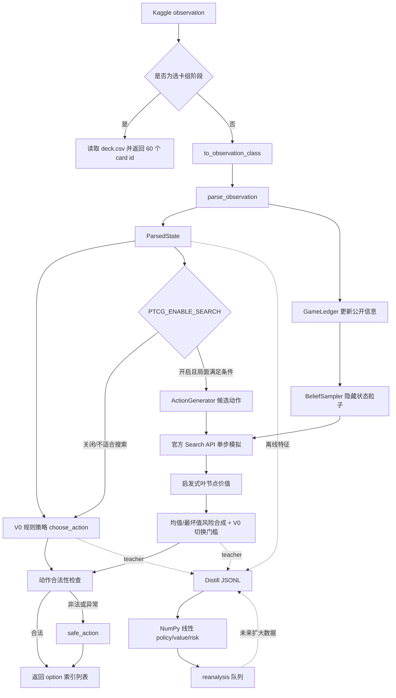

# Pokémon TCG 对战智能体建模技术文档

> 文档基于当前仓库代码与冻结产物整理。本文中的“当前线上/正式方案”特指最终冻结的 `final_submissions/submission_flat_safe_v0.zip`；Search V1、卡组优化和 Distill V2 均属于已跑通但尚未晋级的实验链路。

## 1. 项目结论先行

本项目不是传统意义上“训练一个神经网络，然后直接推理”的单模型系统，而是一套分层的对战决策系统：

1. **V0 规则策略**是当前正式主策略。它把对战 observation 解析成紧凑状态，再按卡组、动作类型和战术上下文为每个合法 option 打分。
2. **V1 有限预算搜索**以 V0 为先验，在部分关键局面采样隐藏状态，调用官方 Search API 向前模拟一步，再用启发式价值函数比较候选动作。该功能默认关闭。
3. **V2 蒸馏模型**用 V0/V1 产生的 teacher 决策训练一个纯 NumPy 的线性 policy/value/risk 多任务模型。目前只有 50 条 smoke 样本，模型状态明确标记为 `experimental_not_promoted`，没有接入正式 agent 推理。
4. **M5 卡组优化**使用规则、标签和 MAP-Elites 思路产生不同特征格的候选卡组，但最终主卡组没有被候选 elite 替换。
5. **安全层**位于所有策略输出之后，检查动作长度、索引范围和重复项；任一解析、规则或搜索异常都会退回保守合法动作。

因此，当前真正部署的是一个**低延迟、卡组特化、带严格合法性兜底的规则智能体**。搜索和学习模型是围绕它建立的增强与迭代基础设施。

## 2. 系统全景



## 3. 代码目录与职责

| 路径 | 主要职责 | 是否进入正式提交 |
| --- | --- | --- |
| `submission/main.py` | 模块化 agent 总入口、卡组读取、搜索开关、兜底编排 | 本地备份版本使用 |
| `submission/agent/parser.py` | observation 容错解析、内部状态、公开信息账本 | 模块化版本使用 |
| `submission/agent/rules.py` | V0 卡组特化规则和 option 打分 | 是，Flat 版本中被内联 |
| `submission/agent/search.py` | V1 有限预算根搜索 | 否，实验备份 |
| `submission/agent/belief.py` | 隐藏牌堆、奖赏卡、手牌粒子采样 | 否，实验备份 |
| `submission/agent/action_gen.py` | 搜索候选联合动作生成 | 否，实验备份 |
| `submission/agent/value.py` | 搜索叶节点启发式价值 | 否，实验备份 |
| `submission/agent/fallback.py` | 合法性检查和保守动作 | 是，Flat 版本中被内联 |
| `src/train/` | 蒸馏数据、特征、训练、重分析 | 否，仅离线研发 |
| `src/cards/` | 卡牌库、标签、卡组规则、候选卡组优化 | 否，仅离线研发 |
| `eval/` | 对战、联赛、统计晋级、坏例回放 | 否，仅离线评估 |
| `scripts/` | Flat 包构建和最终冻结 | 构建工具本身不提交 |
| `models/v2_policy_linear.json` | 实验性线性模型参数 | 不进入主提交 |
| `reports/final_freeze_report.json` | 最终版本选择与证据 | 交付审计材料 |

研发主线应优先阅读 `submission/`、`src/`、`eval/`、`scripts/` 和 `tests/`。`experiments/`、`logs/`、`final_submissions/` 中有大量历史运行结果或代码副本，不应当被当作新的源码主线修改。

## 4. 对战接口与生命周期

### 4.1 唯一入口

Kaggle 调用约定是：

```python
def agent(obs_dict):
    ...
    return [option_index, ...]
```

返回值不是卡牌 ID 或动作枚举，而是当前 `obs.select.option` 中的索引列表。必须满足：

- 长度在 `minCount` 和 `maxCount` 之间；
- 所有元素为整数；
- 索引不越界；
- 索引不重复。

### 4.2 卡组阶段

当 `obs_dict is None` 或 `obs.select is None` 时，agent 返回 `deck.csv` 中的 60 个卡牌 ID。`read_deck_csv()` 依次尝试当前目录、模块目录和 `/kaggle_simulations/agent/deck.csv`，兼容本地 import 与 Kaggle 执行环境。

正式 Flat 包进一步要求：

- zip 根目录直接包含 `main.py`、`deck.csv`、`cg/`；
- `main.py` 不依赖 `__file__`；
- 不导入 `agent/` 子包；
- 不依赖 NumPy 或训练数据；
- 能通过 `exec(main_py_code, env)` 原样执行。

### 4.3 常规决策阶段

模块化入口的实际顺序是：

```text
obs_dict
  -> 官方 dataclass 转换
  -> parse_observation
  -> LEDGER.update
  -> SearchManager.choose
       -> 默认直接调用 V0 choose_action
       -> 搜索开启时尝试 V1
  -> is_legal_action
  -> 若失败，再直接调用 V0
  -> 若仍失败或发生异常，safe_action
```

这形成三层防护：搜索动作、规则动作、通用保守动作。

## 5. observation 的内部状态建模

`parser.py` 故意没有完整复制官方对象，而是只保留决策需要且较稳定的字段，以降低比赛 API 字段变化带来的风险。

### 5.1 `ParsedPokemon`

包含卡牌 ID、实例 serial、当前/最大 HP、所在区域、区域索引、所属玩家、能量数、工具数和本回合是否刚登场。派生属性：

```text
damage = max(0, max_hp - hp)
```

### 5.2 `ParsedPlayer`

包含 active、bench、可见 hand、hand/deck 数量、剩余 prize、discard 和 bench 上限。这里同时保留“可见列表”和“计数”，是为了兼容对手手牌内容不可见但数量可见的情况。

### 5.3 `ParsedSelect`

包含选择类型、选择上下文、最少/最多选择数、option 列表，以及部分效果暴露的 deck、context card 和 effect。

### 5.4 `ParsedState`

包含当前玩家、回合、回合内动作数、赛果、是否已用 supporter、是否已贴能、双方玩家状态、当前选择和日志。`me` / `opp` 根据 `current_player` 动态映射，避免把玩家 0 固定理解为自己。

### 5.5 容错策略

`safe_get()` 同时支持 dict 和 dataclass，并为缺失字段提供默认值；`enum_value()` 同时兼容枚举对象和整数。区域中的 card ID 通过 `card_id_from_area()` 统一解析，覆盖 HAND、DECK、DISCARD、ACTIVE、BENCH 和 LOOKING。

### 5.6 `GameLedger`

账本累计日志类型和公开出现过的卡牌数量，信息来源包括可见手牌、弃牌区、active 和 bench。它只记录公开信息，主要服务于 V1 belief。需要注意，当前 `seen_logs` 是按每次 observation 中 `parsed.logs` 的长度累加；若 API 日志是累计全量而不是增量，这里可能重复计数，但当前搜索采样并未深度使用这些计数修正概率。

## 6. V0：卡组特化规则策略

### 6.1 建模思想

V0 将每次决策建模成合法 option 的排序问题。设局面为 (s)，第 (i) 个候选为 (a_i)，规则系统计算：

\[
S_{rule}(s,a_i)=S_{base}+S_{card}+S_{tempo}+S_{KO}+S_{resource}+S_{risk}
\]

然后按分数降序选取满足 `min_count/max_count` 的索引。可选选择在所有分数非正时可以返回空列表。

这不是通用 TCG 策略，而是围绕当前 Mega Abomasnow 水系卡组设计，核心对象包括 Snover、Mega Abomasnow ex、Kyogre、水能量、检索牌、抽牌 supporter 和 Maximum Belt。

### 6.2 主阶段动作打分

`SelectContext.MAIN` 下按 OptionType 分派：

| 动作 | 主要考虑 |
| --- | --- |
| PLAY | 卡牌基础价值、是否补齐 Snover/Abomasnow 进化线、检索需求、抽牌时机、supporter 是否已使用、工具目标 |
| ATTACH | 卡是否为能量/工具、目标宝可梦准备度、攻击能量缺口、active/bench 位置、active 是否残血 |
| EVOLVE | 是否把 Snover 进化为 Mega Abomasnow ex、目标已有能量、HP、是否为 active |
| ATTACK | 预计伤害、能否 KO、是否击倒 ex、高伤攻击奖励、弃能代价、牌库耗尽风险 |
| RETREAT | active 低血且 bench 可接管时加分，否则通常扣分 |
| END | 固定结束回合权重 |
| ABILITY | 固定正向基础分 |
| DISCARD | 默认低价值弃牌惩罚 |

### 6.3 攻击伤害特化

普通攻击从 `ATTACK_DAMAGE` 查表；部分攻击动态计算：

- Kyogre Riptide：按弃牌区水能量数计算，`damage = 20 × 水能量数`；
- Hammer-lanche：根据剩余牌库估算，并封顶 600；牌库不超过 7 时施加强烈 deck-out 惩罚；
- 特定弃两能攻击额外扣分，反映主攻击线后续节奏损失；
- 若伤害达到对方 active HP，则增加拿奖赏分；击倒 ex 再加额外奖励。

### 6.4 宝可梦准备度

能量附着和换 active 时使用近似准备度：

```text
Mega Abomasnow ex: 600 + energy × 120 + hp / 4
Snover:            360 + energy × 80  + hp / 6
Kyogre:            260 + energy × 90  + hp / 8
其他:                    energy × 50  + hp / 10
```

它把卡种优先级、能量投资和生存能力压缩成一个可排序标量。

### 6.5 非主阶段上下文

选初始 active/bench、从牌库拿牌、选择贴能来源/目标、选择弃牌或回牌库时，策略会根据 `SelectContext` 改变评分方向。例如：

- 初始 active 强烈偏好 Snover，其次 Kyogre；
- 搜索到手时，场上有 Snover 则强烈偏好 Mega Abomasnow ex；
- 尚无 Snover 时优先补 Snover；
- 弃牌/回牌库时把原卡值取负，并额外保护主攻击手与进化基础；
- 水能量进入弃牌区并非完全负面，因为可增强 Kyogre。

### 6.6 多选动作

若必须选固定数量，直接取前 `min_count`。若允许区间选择，则选正分 option 数量，并截断到 `[min_count,max_count]`。排序以 `(score, -index)` 为键，因此同分时较小 option 索引优先，保证确定性。

## 7. V1：隐藏信息下的有限预算搜索

### 7.1 为什么不是完整 MCTS

代码实现的是**belief-guided bounded root search**，而不是多层完整 MCTS。它只生成根节点候选，针对若干隐藏状态粒子调用官方 API 执行动作，再评估动作后的 observation。这样可以严格控制节点数和时间，并始终保留 V0。

### 7.2 搜索触发条件

必须同时满足：

- `PTCG_ENABLE_SEARCH` 开启；
- observation 提供 `search_begin_input`；
- option 数大于 1；
- 不是范围过大的复杂多选；
- select context 位于代码允许的关键上下文集合。

默认配置为 6 个候选、3 个粒子、64 节点、35 ms 时间预算、175 分切换门槛。蒸馏采集的默认 teacher 配置更小：4 候选、1 粒子、16 节点、20 ms。

### 7.3 候选动作生成

`ActionGenerator` 按以下来源去重收集合法动作：

1. V0 动作，prior 1.0；
2. fallback 动作，prior 0.2；
3. 可选空动作，prior 0.05；
4. 规则分数排名靠前的单 option；
5. top-k 组合与前 6 个 option 的组合；
6. 候选不足时随机合法组合。

最后按 prior 排序并截断至预算 `k`。所以搜索空间不是全展开，而是由规则策略引导的窄候选集。

### 7.4 belief 粒子

对不可见牌，`BeliefSampler` 从已知 60 卡卡组减去公开卡牌，得到剩余池，再随机分配隐藏 prize、deck 和 hand。若对方 active 是隐藏占位，则用 Snover 补充一个合法 active 假设。

这里有一个重要假设：对手也按当前已知卡组分布采样。因此它对镜像或同卡组对战更合理，对未知异构卡组存在模型偏差。

### 7.5 叶节点价值函数

终局直接返回：胜 `+100000`、负 `-100000`、平 `0`。非终局价值为：

\[
V(s)=900\times(oppPrize-myPrize)+Board(me)-Board(opp)+Threat
\]

其中 `Board` 综合：

- Mega Abomasnow ex、Snover、Kyogre 的卡种基础价值；
- 能量数与当前 HP；
- 手牌数量；
- 剩余牌库数量及薄牌库惩罚；
- 弃牌区水能量的 Kyogre 协同价值。

`Threat` 额外判断双方已准备好的 Mega Abomasnow 是否能威胁低 HP active。

### 7.6 风险合成与切换保护

一个候选在多个粒子上的值为 `vals`：

\[
S_{search}=(1-\rho)\cdot mean(vals)+\rho\cdot min(vals)+25\cdot prior
\]

默认 (
ho=0.35)，即同时考虑平均收益与最坏粒子。每次分数还加入很小的 Gumbel 扰动以处理探索/同分。

即便搜索首选不同于 V0，也只有当它至少比 V0 高 `switch_margin=175` 才切换；否则返回 V0。这是一个保守的“搜索必须拿出充分证据”门槛。

### 7.7 资源释放与降级

每个 child/root search ID 都在 `finally` 中释放，一轮搜索后调用 `search_end()`。任何粒子失败、API 异常、无候选得分、超时或非法输出都会回退 V0。搜索统计记录 calls、used_search、fallbacks、errors、nodes 和最近报告，供蒸馏采集使用。

## 8. V2：策略蒸馏数据链路

### 8.1 目标

V2 的目标是把较慢的 V1 teacher 压缩成极低延迟的小模型，同时学习：

- `policy`：选择哪个 option；
- `value`：被选动作的局面/搜索价值；
- `risk`：薄牌库、残血 active 等启发式风险。

但当前实现只是验证管线连通性，没有达到生产数据规模。

### 8.2 样本来源

`collect_distill.py` 默认读取 `tests/fixtures/observations.json`，逐条执行：

```text
observation
 -> V0 action
 -> 可选 V1 search action
 -> final_action
 -> 可见信息特征
 -> teacher 搜索摘要
 -> JSONL 样本
```

当前 smoke 数据共 50 条，按每 10 条组成一个 `game_id`，最终形成 5 个 game group。注意这些 `game_id` 是 fixture 分组标识，不等同于重新完整自对弈生成的真实比赛轨迹。

### 8.3 固定 schema

每条样本至少包含：

| 字段 | 含义 |
| --- | --- |
| `sample_id`, `game_id` | 样本与对局分组标识 |
| `turn`, `current_player` | 回合上下文 |
| `select` | 类型、上下文、min/max、option 数 |
| `legal_mask` | option 合法 mask；当前采集器全部置 True |
| `v0_action` | 规则 teacher 动作 |
| `search_action` | 搜索输出或 V0 回退动作 |
| `final_action` | 实际训练 policy 目标 |
| `search` | chosen source、耗时、候选数、visits、Q 值和 raw scores |
| `features` | 仅局面级可见特征 |
| `option_features` | 每个 option 的完整模型输入向量 |
| `options` | 可解释的 option 摘要 |
| `value_target` | teacher 分数缩放到 `[-1,1]` |
| `risk_target` | 启发式风险，范围 `[0,1]` |
| `is_key` | 分歧、多候选、可变多选、薄牌库等关键局面标记 |

校验器检查必需字段、schema 版本、option 数量一致性，以及三个动作标签的长度、去重和索引范围。

### 8.4 防止隐藏信息泄漏

模型特征只从比赛可见 observation 产生。官方 Search API 使用的隐藏全状态可以作为 teacher 的计算条件，但不能序列化进 `features/options`。这是部署一致性的关键约束：学生模型在 Kaggle 推理时不应依赖训练期特权信息。

## 9. 特征工程

每个 option 的输入是：

\[
x_i = concat(global(s), local(s,a_i))
\]

当前共有 27 个 global 特征和 54 个 option 特征，即每个 option **81 维**。

### 9.1 全局 27 维

- 回合、回合内动作数；
- 是否已用 supporter、是否已贴能；
- 双方剩余 prize；
- 双方 hand/deck 数；
- 双方 bench 数；
- 双方 active 的 HP、最大 HP、damage、能量；
- 我方弃牌总数和弃牌区水能量数；
- select type/context/min/max；
- option 数量。

### 9.2 option 局部 54 维

- option index/type；
- V0 `rule_score`，这意味着学生显式利用规则 teacher 的先验；
- 卡牌是否可识别、缩放 card ID；
- `card_id % 16` 的 16 维 one-hot hash fallback；
- 来源 area、player；
- 目标 area、player、HP、damage、energy；
- 是否攻击、缩放 attack ID；
- 是否能量、Snover、Abomasnow/主攻击手、Kyogre；
- 20 个卡牌标签：能量、基础/进化宝可梦、ex、检索、抽牌、supporter、item、tool、增伤、治疗、弃牌、回收、压缩牌库、ACE SPEC 等。

### 9.3 数值缩放

连续值使用人工分母缩放并裁剪，例如 turn/50、HP/400、deck/60、energy/8、rule_score/2000。优点是无需拟合 scaler，提交简单稳定；缺点是缩放上限与领域常量绑定，超出预期范围会丢失幅度信息。

## 10. 线性多任务模型

### 10.1 Policy head

对每个 option：

\[
z_i=x_i^T w_p+b_p,\quad p_i=softmax(z)_i
\]

`final_action` 若包含多个索引，则目标概率在所选索引上均分。损失是交叉熵加 L2。没有选择任何 option 的可选空动作样本不会训练 policy，因为当前模型没有显式的“空动作 logit”。这是当前设计的一项明显局限。

### 10.2 Value/Risk head

先对最终动作对应的 option 向量求均值；若最终动作为空，则对所有 option 求均值。之后分别做线性回归：

\[
\hat v=\bar x^T w_v+b_v,\quad \hat r=\bar x^T w_r+b_r
\]

使用平方误差和 L2 更新。训练为逐样本 SGD，默认参数：

```text
epochs       = 80
policy lr    = 0.04
value/risk lr= 0.02
l2           = 1e-4
seed         = 20260706
valid ratio  = 0.2
```

为避免 smoke 数据数值爆炸，输入中的 NaN/Inf 会清洗，权重裁剪到 `[-20,20]`，value/risk bias 裁剪到 `[-5,5]`。

### 10.3 标签的真实含义

`value_target` 不是最终胜负价值，而是搜索 Q 或规则分数除以 1200 后裁剪。因此当前 value 更接近“teacher 对当前选择的启发式评分”。`risk_target` 也不是从失败概率监督得到，而是由薄牌库、active 残血和可选空动作人工组合：

```text
risk = clip(0.45 × thin_deck + 0.45 × fragile_active + optional_empty, 0, 1)
```

因此不能把这两个 head 解读为经过真实赛果校准的胜率和风险概率。

## 11. 数据切分与当前指标

数据按 `game_id` 切分，而不是随机按行切分，避免同一轨迹或相邻 fixture 同时进入训练和验证。当前切分：

- train：4 个 group，40 条样本；
- valid：1 个 group，10 条样本。

当前 `train_metrics.json`：

| 指标 | Train | Valid |
| --- | ---: | ---: |
| Policy 样本 | 39 | 10 |
| Top-1 | 0.8718 | 0.9000 |
| Top-3 | 0.9744 | 1.0000 |
| Policy CE | 0.6553 | 0.4856 |
| Value MSE | 0.0326 | 0.2501 |
| Value correlation | 0.9366 | **-0.2245** |
| Risk MSE | 0.00027 | 0.00356 |
| Risk correlation | 0.9863 | 0.4328 |

线性 policy 单次 select 打分约 `0.0093 ms`。但 10 条验证样本太少，且 value 验证相关性为负，说明模型没有形成可泛化的价值估计。Top-1 较高也可能主要来自规则分数作为输入及局面重复性，不能据此判断 V2 强于 V0/V1。

## 12. Reanalysis 闭环

`reanalysis.py` 用当前 policy 对已有样本重新打分，优先级主要增加于：

- V0 与 final/V1 不一致：+3；
- `is_key`：+2；
- 模型置信度 ≥ 0.65 但 top-1 错误：+2；
- 终局或 option 很多：+1；
- 失败结果：+1；
- 再加模型置信度和 0.5 倍 risk。

输出 `data/reanalysis_queue.json`，理论上用于把最有信息量的局面重新交给更高预算 search teacher。当前代码只生成排序队列，尚未实现自动消费队列、重跑 teacher、合并数据和周期训练的完整循环。

## 13. 卡牌知识与卡组优化

`src/cards/` 将卡组层建模独立于局内动作策略：

- `card_db.py` 生成统一卡牌数据；
- `tags.py` 生成规则和模型共用的语义标签；
- `deck_rules.py` 检查 60 卡与构筑合法性；
- `deck_optimizer.py` 生成不同 archetype 的候选，并以代理分数筛选 MAP-Elites 特征格。

MAP-Elites 的价值是保留风格多样性，而不是只保留一个代理分最高的卡组。仓库已有 aggressive prize、stable setup、defensive recovery、anti-ex tech、Abomasnow high-energy 等 elite。代理分只负责缩小候选空间，真正晋级仍需固定基线联赛和完整回归。

最终冻结报告把 `m5_deck_elite` 标记为 `not_promoted`，说明卡组优化结果没有替代正式 `submission/deck.csv`。

## 14. 评估体系

### 14.1 单次批量对战

`eval/run_match.py` 动态加载双方 agent，调用官方 `battle_start/battle_select/battle_finish`，逐次验证动作并记录：

- 胜、负、平；
- steps 和 selection 数；
- 每方总耗时和逐决策耗时；
- 异常、非法动作；
- 是否因最大步数判平；
- 可选完整 trace、回归 fixture 和坏例。

异常不会中止整批实验，而会记录 traceback 并继续下一局。

### 14.2 联赛与对手

固定联赛可覆盖 Random、Sample、Exploiter-FirstMin、V0-current、V0-best 等对手。Random 主要验证基本强度，FirstMin 暴露对固定弱规则的鲁棒性，V0-best 才更接近版本间提升判断。

### 14.3 统计晋级

`eval/stats.py` 使用 Wilson 95% 区间：

- 有异常或非法动作：淘汰；
- 少于 200 局：只观察；
- 相对基线胜率提升超过 2%，且 Wilson 下界高于基线：晋级；
- Wilson 上界低于基线：淘汰；
- 其余：观察。

### 14.4 冻结证据

最终冻结报告中的关键结果包括：

| 版本/对手 | 局数 | 胜率 | p95 决策耗时 | 异常/非法 |
| --- | ---: | ---: | ---: | ---: |
| Flat Safe V0 vs Random | 200 | 92.5% | 0.197 ms | 0 / 0 |
| Safe V0 vs Random | 200 | 92.0% | 0.173 ms | 0 / 0 |
| Search V1 vs Random | 100 | 92.0% | 4.212 ms | 0 / 0 |
| Search V1 审计 vs Random | 100 | 94.0% | 4.226 ms | 0 / 0 |
| Search V1 稳定性 vs Random | 5000 | 90.3% | 2.201 ms | 0 / 0 |

V1 的确稳定，但对 Random 的结果尚不足以证明其在同等预算下显著强于 V0，而且延迟高一个数量级以上。因此冻结选择优先保证 Kaggle 兼容性、无依赖和低延迟，最终采用 Flat Safe V0。

## 15. 最终部署版本为何不是“模型版”

冻结决策如下：

| 候选 | 决策 |
| --- | --- |
| Flat V0 rules | `promoted_primary` |
| Multi-module V0 | `local_backup_only` |
| V1 search | `experimental_backup_only` |
| V2 distill | `not_kaggle_submission` |
| M5 deck elite | `not_promoted` |

原因不是模型无法运行，而是工程证据不足：

1. V2 只有 50 条 smoke 样本；
2. teacher V1 尚未证明稳定优于主线；
3. value 验证相关性为负；
4. V2 没有接入 `submission/main.py` 的推理路径；
5. Flat V0 已经证明 raw-exec 兼容、速度极快、零异常零非法；
6. 正式提交不引入 NumPy、模型文件定位和序列化加载风险。

## 16. 从零复现整个研发流程

### 16.1 环境

```bash
conda create -n pokemon-tcg python=3.11 -y
conda activate pokemon-tcg
pip install numpy pytest
```

### 16.2 引擎与规则回归

```bash
python submission/test_sim.py
pytest -q
```

### 16.3 V0 对战评估

```bash
python eval/run_match.py --agent0 submission --agent1 random --games 200
python eval/run_match.py --agent0 submission --agent1 first-min --games 200
python eval/league.py --candidate submission --games 500
```

### 16.4 V1 搜索评估

PowerShell：

```powershell
$env:PTCG_ENABLE_SEARCH = "1"
python eval/run_match.py --agent0 submission --agent1 random --games 200
Remove-Item Env:PTCG_ENABLE_SEARCH
```

应额外做 V0 vs V1 的双向/换先手比较，而不是只分别对 Random 比较。

### 16.5 卡牌库与候选卡组

```bash
python src/cards/card_db.py
python src/cards/tags.py
python src/cards/deck_rules.py submission/deck.csv
python src/cards/deck_optimizer.py --per-archetype 150
```

### 16.6 蒸馏数据与训练

```bash
python src/train/collect_distill.py --max-samples 50 --search
python src/train/train_distill.py
python src/train/reanalysis.py
python tests/test_distill_pipeline.py
```

### 16.7 构建与冻结

```bash
python scripts/build_flat_submission.py --name safe_v0
python scripts/freeze_final.py
```

`freeze_final.py` 会重建相关冻结目录和报告，应只在全部测试和候选评估完成后运行。

## 17. 修改代码时的验证矩阵

| 修改范围 | 最少验证 |
| --- | --- |
| parser / observation 字段 | regression、fallback、战术测试、批量对战非法动作检查 |
| V0 规则权重/分支 | regression、tactics、固定基线联赛、坏例回放 |
| V1 belief/search/value | `test_m3_search.py`、搜索开关批量对战、耗时 p95、Search API 资源释放 |
| 卡组 | deck rules、deck optimizer、固定联赛、完整回归 |
| 特征/schema | distill pipeline、schema 校验、特征维数与模型 feature_names 一致性 |
| 训练代码 | 按 game 切分、指标复现、数值稳定性、空动作样本处理 |
| Flat 构建 | `test_flat_submission.py`、raw exec、无 `__file__`、zip 根目录检查 |

## 18. 已知局限和技术风险

### 18.1 规则策略泛化有限

V0 中大量 card ID、attack ID、权重和特殊分支绑定 Mega Abomasnow 卡组。换卡组或卡池后，策略不会自动泛化，必须更新 `deck_profile`、标签、伤害逻辑和战术测试。

### 18.2 对手 belief 假设偏强

V1 用自己的已知卡组作为对手隐藏牌分布。在未知对手卡组环境中，模拟可能系统性错误。`GameLedger` 目前也没有完成基于已见卡牌推断对手 archetype 并切换先验。

### 18.3 搜索深度浅

搜索主要评估执行当前候选后的叶节点，没有显式展开对手最佳回应，多步资源交换可能被静态 value 误判。`opponent_rho` 只是对隐藏粒子最坏值保守，不等于 minimax 对手建模。

### 18.4 teacher 标签不是纯最优策略

搜索候选由 V0 强引导，叶价值也由规则定义，所以 V2 学到的是规则和浅搜索的压缩，而非超越 teacher 的独立策略。`rule_score` 又直接进入特征，进一步提高了模仿性但限制了发现新策略的能力。

### 18.5 空动作没有 policy 类别

当 `final_action=[]` 时，样本不参与 policy 交叉熵。未来应加入显式 PASS/EMPTY logit，或者把联合动作整体编码为候选类别。

### 18.6 多选动作建模不完整

当前 policy 独立给 option 打分，多选标签均分概率，推理若简单 top-k，无法表达 option 之间的互补、冲突和顺序。ActionGenerator 中虽然有联合动作，但线性学生没有联合动作 head。

### 18.7 value/risk 目标未由真实赛果校准

value 来自 teacher 启发式分数，risk 来自人工公式。它们适合 smoke 多任务正则，但不应当直接用于胜率解释或线上风险阈值。

### 18.8 数据量和独立性不足

50 条 fixture 样本、1 个验证 group 无法支撑可靠泛化结论。验证 Top-1 90% 与 value 负相关同时出现，正说明当前指标方差很大。

## 19. 建议的下一阶段建模路线

按风险和收益排序，建议：

1. **先扩大 teacher 质量而非立即加深模型。** 生成真实完整对局轨迹，覆盖不同对手、先后手、关键 select context 和卡组；至少数十万条，再谈生产蒸馏。
2. **做 V0/V1 直接配对实验。** 固定卡组和种子，交换 agent0/agent1，至少数千局；用 Wilson 区间判断 V1 是否真有增益。
3. **改进对手 belief。** 根据公开卡牌标签和数量在线估计 archetype，使用多个候选卡组的混合先验，而非固定镜像卡组。
4. **把 teacher 搜索升级为多步但可控。** 在关键主阶段加入一层对手回应，配合 transposition/cache 和严格时间中断。
5. **重新定义训练目标。** value 使用最终胜负或 n-step 回报；risk 使用实际非法、超时、deck-out、被 KO 等事件标签。
6. **显式建模联合动作。** 将 ActionGenerator 产生的联合动作作为 policy 候选，模型直接给候选动作打分，从结构上解决多选和空选。
7. **再升级为小型 MLP/embedding。** 可从 1M 以下参数开始，保留纯 NumPy/ONNX 或可内联权重的部署路径；任何升级都必须对比 Flat V0 的延迟和可靠性。
8. **建立自动 reanalysis 循环。** 队列消费、高预算 teacher、样本去重、数据版本、训练、离线门槛和联赛晋级全自动化。

## 20. 一句话理解整个建模方案

当前系统以**可解释的卡组特化规则**保证基本强度，以**公开信息 belief + 浅层有限预算搜索**尝试提高关键局面质量，以**线性多任务蒸馏**探索低延迟学习化方向，再通过**合法性兜底、批量联赛、Wilson 统计和 Flat raw-exec 冻结**控制比赛部署风险；截至当前代码版本，证据最充分的仍然是 Flat Safe V0，而不是搜索版或蒸馏模型版。
