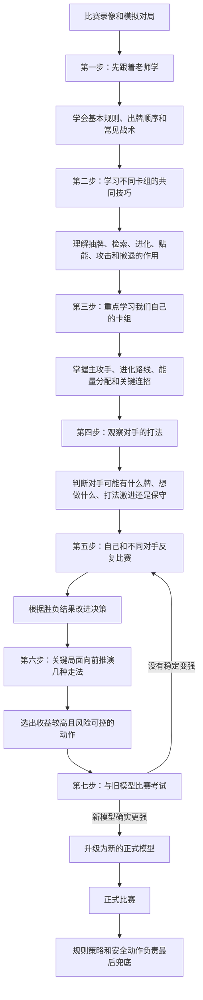
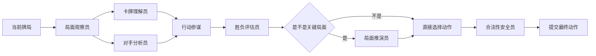
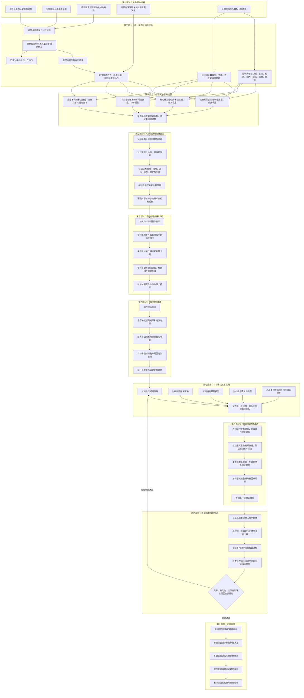
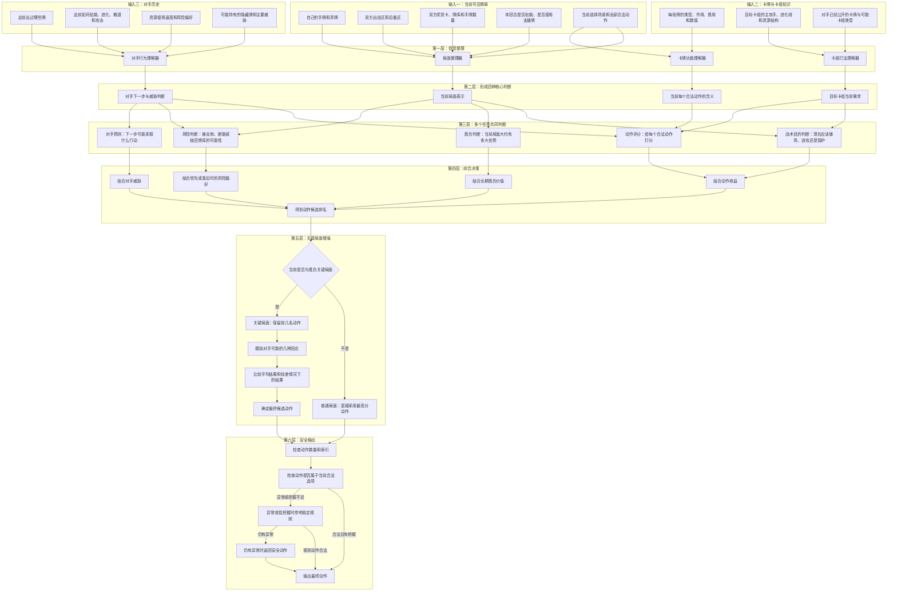
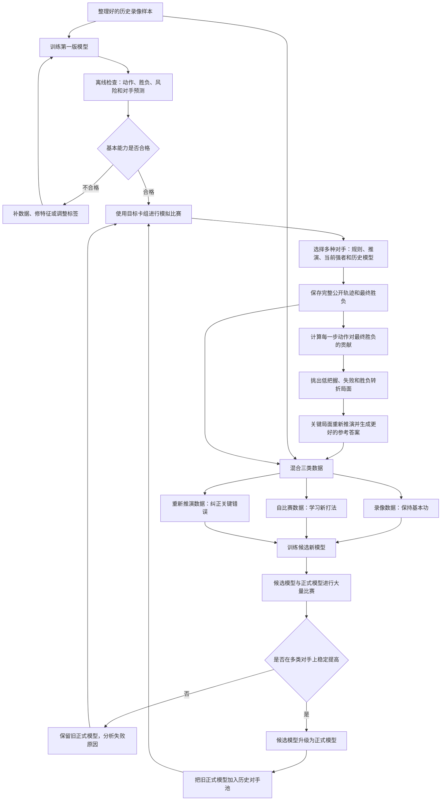
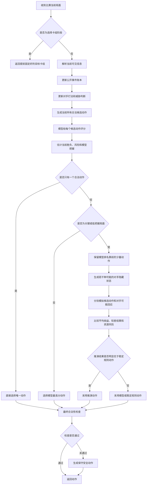
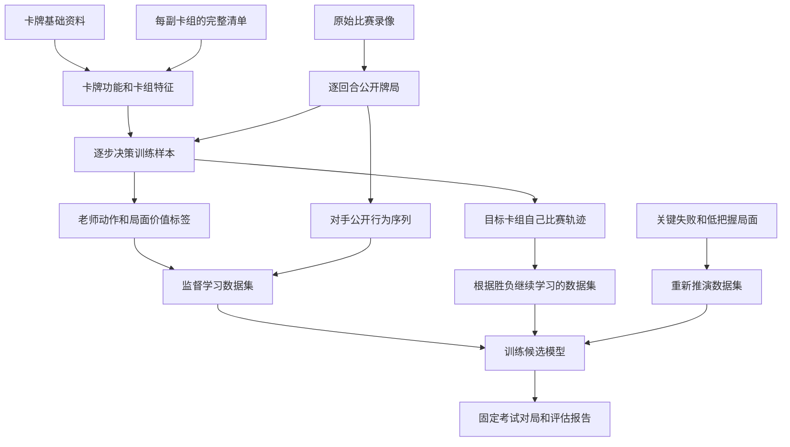
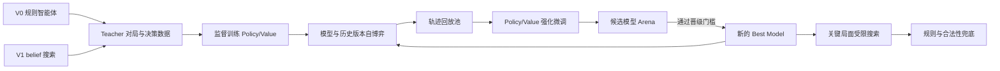
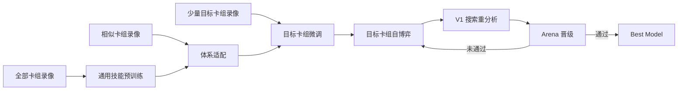

# Pokémon TCG AI Battle 建模方案

> 文档定位：本文件是项目当前唯一研发主线，定义“监督预训练 + Top10 卡组并行适配与择优 + 冠军卡组自博弈强化 + 固定评估晋级”的完整路线。旧技术与 M0～M6 文档已归档到 `docs/archive/mvp/`，不再作为当前状态依据。
> 当前代码基线：V0 规则策略可稳定输出合法动作；V1 已具备 belief 采样和有限预算搜索；V2 已具备 teacher 数据采集及 policy/value/risk 蒸馏骨架。

## 1. 结论与推荐

不建议直接照搬 AlphaGo Zero 的“随机初始化 + 纯自博弈 MCTS”。Pokémon TCG 与围棋存在三个关键差异：

1. 对手手牌、牌库顺序和奖赏卡不可见，是不完全信息博弈；
2. 合法动作类型和数量随选择上下文变化，动作空间不是固定棋盘坐标；
3. 对局随机性、卡组差异和模拟成本都更高，纯强化学习的样本效率较低。

### 1.1 通俗版总路线图

我们最终要做的不是一个只会背固定出牌顺序的模型，而是一个由多个能力共同组成的“牌局决策大脑”。它的工作方式可以简单理解为：



一句话概括：

> 先看录像学会打牌，再重点学会使用我们的卡组，然后通过自己比赛积累经验，同时观察对手调整打法，最后在关键局面多想几步。

### 1.2 这个模型到底长什么样

可以把整个模型想象成一个由七个角色组成的教练组：



它们分别负责：

| 通俗名称 | 负责什么 | 对应的技术部分 |
| --- | --- | --- |
| 局面观察员 | 把双方场面、手牌数量、奖赏卡和牌库情况整理清楚 | 状态解析和局面特征 |
| 卡牌理解员 | 理解一张牌是主攻、抽牌、检索、进化、回收还是换位 | 卡牌语义和卡组表示 |
| 对手分析员 | 根据对手已经公开的动作，判断他的意图、风格和可能持牌 | 对手历史表示和隐藏信息推断 |
| 行动参谋 | 给当前所有合法动作分别打分 | 动作选择模型 |
| 胜负评估员 | 判断当前局面大概是优势还是劣势 | 局面价值模型 |
| 局面推演员 | 在重要局面尝试几种走法，再比较后果 | 有限步数搜索 |
| 合法性安全员 | 防止模型返回非法动作，异常时使用稳定规则 | 规则基线和安全回退 |

这些部分可以放在一个共享的“小型神经网络”中共同训练，不一定真的运行七个独立程序。拆开讲只是为了说明每一部分在学什么。

### 1.3 一次实际决策是怎么产生的

假设轮到我们行动，模型会按下面的顺序思考：

```text
1. 读取当前公开牌局
2. 整理自己能看到的牌、双方场面和资源
3. 回顾对手前几回合做过什么
4. 推测对手可能的下一步和主要威胁
5. 列出当前所有合法动作
6. 判断每个动作是否符合我们卡组的战术
7. 分别估计动作带来的收益和风险
8. 普通局面直接选择最高分动作
9. 关键局面再向前模拟几种可能
10. 检查动作是否合法，确认后返回
```

例如，我们可以选择“给主攻手贴能”或者“给后备宝可梦贴能”：

- 卡牌理解部分知道谁是主攻手、谁是后备接管者；
- 对手分析部分判断对面下一回合是否可能击倒我方主攻手；
- 行动选择部分比较立即进攻和提前准备后备的收益；
- 胜负评估部分判断当前领先还是落后；
- 如果这是胜负转折点，推演部分再模拟对手的几种回应；
- 最后选择“收益较好，而且即使判断有误也不容易崩盘”的动作。

### 1.4 模型是怎样一步步学会的

整个训练不是一次完成，而是分五层逐渐提高：

| 学习阶段 | 使用的数据 | 主要学习内容 | 得到的结果 |
| --- | --- | --- | --- |
| 第一层：基础学习 | 所有可用比赛录像 | 游戏常识和通用战术 | 一个基本会打牌的模型 |
| 第二层：同类卡组学习 | 与我们卡组机制相似的录像 | 相似进化、贴能和资源节奏 | 一个理解这类卡组的模型 |
| 第三层：目标卡组学习 | 少量相同卡组录像、规则老师和搜索老师数据 | 我们卡组的具体连招和优先级 | 一个会用我们卡组的模型 |
| 第四层：反复实战 | 模型与规则、搜索、旧模型和不同卡组比赛 | 从最终胜负中修正策略 | 一个能够持续提高的模型 |
| 第五层：针对对手 | 对手的公开行为记录 | 根据对手风格调整，但不过度冒险 | 一个能够局内适应的模型 |

其中最重要的数据分工是：

- 其他卡组录像负责教“通用打牌能力”；
- 相似卡组录像负责教“这一类卡组的打法”；
- 我们卡组的少量录像负责教“具体出哪张牌”；
- 自己比赛产生的新录像负责弥补目标卡组数据不足；
- 对手的公开动作负责教模型在单局中调整判断。

### 1.5 正式比赛时使用的是哪一部分

训练阶段可以使用大量录像、反复比赛和较慢的搜索；正式比赛时只携带训练完成的小模型和必要的规则，不会在现场重新训练。

正式运行结构为：

```text
小模型负责大多数普通决策
        ↓
关键局面才进行少量推演
        ↓
模型没有把握时参考稳定规则
        ↓
所有输出都经过合法性检查
```

这样可以同时兼顾决策能力、运行速度和提交稳定性。

### 1.6 详细工程路线图

下面这张图把数据准备、初步学习、目标卡组适配、对手学习、反复实战、关键局面推演、模型考试和正式部署全部串起来。



这条路线的关键不是把所有数据混在一起，而是让不同数据负责不同任务：

| 数据来源 | 主要教什么 | 不适合直接教什么 |
| --- | --- | --- |
| 完全不同卡组录像 | 通用节奏、资源管理、攻击与撤退时机、局面价值 | 我们卡组的具体出牌和连招 |
| 相似卡组录像 | 进化节奏、能量分配、相似体系的战术目的 | 目标卡组特有卡牌的精确优先级 |
| 目标卡组录像 | 具体出牌、检索、进化、贴能和弃牌选择 | 单独承担全部通用能力学习，数据量不够 |
| 规则策略对局 | 合法稳定的基础动作和安全兜底 | 发现规则中从未出现的新打法 |
| 有限推演策略对局 | 关键局面的优质动作和局面价值 | 大规模覆盖所有普通局面，成本太高 |
| 模型自己比赛 | 从胜负中发现更好的目标卡组策略 | 一开始从零学习规则和基础常识 |

### 1.7 模型内部详细结构图

下面是模型收到一个牌局后，内部各部分怎样交换信息。为了便于阅读，图中全部使用功能名称。



模型最终不是只输出一个动作，还应在内部得到这些结果：

```text
当前合法动作的分数和概率
当前局面的优势程度
主要风险的概率
对手下一战术目的的概率
对手关键威胁的概率
模型自身是否有把握
是否需要启动关键局面推演
```

### 1.8 训练循环详细图

“跟录像学习”和“自己比赛提高”不是互相替代，而是循环进行：



每一轮训练至少保留三类样本，防止模型只记住最近一批对手：

| 样本类别 | 建议初始比例 | 作用 |
| --- | ---: | --- |
| 历史录像与老师数据 | 30%～40% | 保持合法动作和基本战术 |
| 目标卡组最新自比赛数据 | 40%～50% | 学习当前模型真正遇到的问题 |
| 失败局面和重新推演数据 | 15%～25% | 集中修正关键错误 |

### 1.9 正式比赛详细决策图

训练结束后，正式比赛中的一次决策按以下顺序执行：



为了控制运行时间，只有以下情况才建议启动推演：

- 本回合可能直接击倒对手或被对手击倒；
- 进化、撤退、换位和贴能目标存在明显分歧；
- 双方剩余奖赏卡很少；
- 牌库即将耗尽；
- 模型前两名动作分数非常接近；
- 对手威胁判断很高；
- 当前动作可能决定下一回合主攻手能否启动。

### 1.10 各阶段交付物和通过标准

| 阶段 | 需要做出来的东西 | 至少通过什么检查 | 不通过怎么办 |
| --- | --- | --- | --- |
| 数据整理 | 统一牌局样本、卡牌功能、卡组特征、对手公开历史 | 无隐藏信息泄漏，同局数据不跨训练和验证集 | 修复解析和数据划分 |
| 通用学习 | 能理解局面、卡牌作用、战术目的和基本胜负 | 在多卡组验证集上稳定，合法动作接近百分之百 | 补标签、调整特征和样本权重 |
| 目标卡组学习 | 会用目标卡组进行具体检索、进化、贴能和攻击 | 对稳定规则策略不退化 | 提高目标数据比例或增强卡组适配部分 |
| 对手学习 | 能根据公开历史预测意图和主要威胁 | 使用对手历史比清空历史的胜率更高 | 先退回统计特征，检查行为标签 |
| 自比赛提高 | 候选模型从胜负中修正策略 | 对当前正式模型胜率有统计把握的提升 | 保留旧模型，分析失败局面 |
| 关键局面推演 | 在少量困难局面修正规则和模型错误 | 提升胜率且运行时间不过限 | 减少候选动作、隐藏状态数量和推演深度 |
| 正式部署 | 小模型、规则和安全检查组成提交包 | 合法、稳定、快速、可复现 | 自动回退到稳定规则版本 |

因此，整个备选方案最终可以归纳为三个核心模型加两个保护层：

```text
核心模型一：动作选择——现在具体应该做什么
核心模型二：局面评估——这样做以后大概是赢还是输
核心模型三：对手分析——对手可能做什么以及有什么威胁

增强能力：关键局面向前推演
安全保护：稳定规则与合法性检查
```

### 1.11 这套方案具体需要哪些数据

这套方案需要的数据不是单独一张“大表”，而是八类相互关联的数据。最核心的关系如下：



八类数据分别是：

1. 卡牌基础资料；
2. 卡组清单与卡组特征；
3. 原始完整比赛录像；
4. 每一步决策训练样本；
5. 对手公开行为与威胁标签；
6. 目标卡组自己比赛的数据；
7. 关键局面重新推演的数据；
8. 固定测试和模型晋级数据。

下面分别说明每一类数据需要什么字段、从哪里获得，以及用来训练什么。

#### 1.11.1 卡牌基础资料

这是模型理解“每张牌有什么作用”的基础数据。每个卡牌版本至少需要：

| 字段 | 通俗解释 | 是否必须 |
| --- | --- | --- |
| 卡牌编号 | 唯一识别一张牌 | 必须 |
| 卡牌名称 | 方便查看和排错 | 必须 |
| 卡牌类型 | 宝可梦、训练家或能量 | 必须 |
| 宝可梦阶段 | 基础、一阶、二阶等 | 宝可梦必须 |
| 进化来源 | 由哪只宝可梦进化 | 进化宝可梦必须 |
| 生命值 | 宝可梦可承受伤害 | 宝可梦必须 |
| 属性与弱点 | 影响伤害和克制 | 规则可用时必须 |
| 撤退费用 | 换下出战区需要多少资源 | 宝可梦必须 |
| 攻击列表 | 每个攻击的名称、费用、伤害和效果 | 宝可梦必须 |
| 特性列表 | 被动或主动能力 | 有特性时必须 |
| 训练家效果 | 抽牌、检索、回收、换位等具体效果 | 训练家必须 |
| 使用限制 | 每回合限制、使用对象和触发条件 | 必须 |
| 奖赏价值 | 被击倒后对方拿几张奖赏卡 | 宝可梦必须 |
| 规则版本 | 防止不同版本卡牌效果混淆 | 建议 |

在基础字段之外，还要为每张牌补充机器容易学习的“功能标签”：

```text
主攻手
后备攻击手
基础宝可梦
进化组件
抽牌
检索宝可梦
检索能量
能量加速
回收资源
换位或撤退帮助
伤害增强
治疗
弃牌协同
牌库压缩
高价值特殊卡
```

一张牌可以同时拥有多个标签。例如，一张牌既可能负责检索，也可能帮助压缩牌库。

当前仓库基础：

- `data/cards.json` 已提供卡牌资料起点；
- `data/card_tags.json` 已提供部分功能标签；
- `src/cards/card_db.py` 和 `src/cards/tags.py` 已有读取与标注逻辑。

仍需检查：卡牌效果是否完整、数值是否与比赛规则一致，以及目标卡组全部卡牌是否都有功能标签。

#### 1.11.2 卡组清单与卡组特征

每一场录像必须知道双方使用的卡组。如果只能知道己方卡组，也要明确把对手卡组标记为未知，不能随便填一个卡组。

每副卡组需要保存：

```text
卡组编号
卡组版本
每张卡牌的编号和数量
主要能量类型
主攻手和后备攻击手
完整进化路线
宝可梦、训练家和能量数量
抽牌、检索、回收、换位和能量加速数量
平均攻击启动费用
预计启动速度
卡组主要打法标签
```

这些数据有三个用途：

1. 判断一场异构录像与目标卡组有多相似；
2. 让模型知道当前使用的是哪一类卡组；
3. 在相同牌局下，根据不同卡组调整动作优先级。

当前仓库基础：

- `submission/deck.csv` 当前是 Abomasnow 旧基线；排行榜 Top10 完成统一策略和适配策略筛选后，冠军才成为正式目标卡组；
- `data/deck_candidates.json` 和 `data/deck_elites/` 包含候选卡组；
- `data/deck_eval_records.json` 包含部分卡组评估记录。

仍需补充：所有录像对应的卡组编号、卡组版本，以及统一的卡组功能统计。

#### 1.11.3 原始完整比赛录像

原始录像不能只有最终胜负或几个精彩片段。为了训练动作选择和对手判断，必须尽量还原完整对局。

每场比赛至少需要：

| 字段 | 说明 |
| --- | --- |
| 比赛编号 | 用于把整局数据绑定在一起 |
| 数据来源 | 人类比赛、规则模拟、搜索模拟或模型自比赛 |
| 双方身份 | 玩家 0 和玩家 1 |
| 双方卡组编号 | 未知时明确标记未知 |
| 先后手 | 用于处理先手优势 |
| 随机种子 | 模拟比赛必须记录，真实录像没有可为空 |
| 规则和模拟器版本 | 保证录像能正确还原 |
| 每回合开始和结束状态 | 用于重建牌局变化 |
| 每一次公开动作 | 出牌、贴能、进化、攻击、撤退、选择目标等 |
| 每次选择时的合法动作 | 能重建时必须保存 |
| 公开日志 | 用于建立对手历史 |
| 最终结果 | 胜、负、平以及结束原因 |
| 异常情况 | 超时、非法动作、解析错误或模拟错误 |

最有价值的录像是能够从双方视角交替还原决策的完整录像。这样一场比赛可以生成两类样本：

- 当前玩家的动作选择样本；
- 另一方观察当前玩家时的对手行为样本。

如果外部录像只有画面或文字日志，需要先转换成统一事件。无法可靠还原合法动作时，仍可用于训练战术意图、对手行为和胜负判断，但不应把未出现的动作当成错误动作。

#### 1.11.4 每一步决策训练样本

模型真正训练时使用的核心单位不是“一场比赛”，而是“轮到某个玩家做一次选择时的一个样本”。

建议每个决策样本保存：

```text
样本编号
比赛编号
当前回合和回合内第几次动作
当前玩家
己方和对方卡组特征
当前玩家真正可见的牌局信息
对手此前公开行为摘要
当前选择场景
最少和最多需要选择几个动作
当前全部合法候选动作
每个候选动作的卡牌、来源、目标和资源特征
实际采取的动作
老师推荐动作及每个候选动作的参考分数
当前战术目的标签
最终胜负
当前局面价值标签
主要风险标签
数据来源与样本权重
特征版本和标签版本
```

其中有三个字段最容易出错：

1. **合法候选动作**：必须是当时真实可选的动作，不能使用另一个时刻的动作集合；
2. **可见牌局信息**：不能包含对手隐藏手牌和真实牌库顺序；
3. **实际动作**：必须能准确对应候选动作中的索引或组合。

一个简化样本可以长成：

```text
当前牌局：我方主攻手还差一张能量，对手出战宝可梦下回合可能攻击
当前合法动作：
  动作 0：给主攻手贴能
  动作 1：给后备宝可梦贴能
  动作 2：使用抽牌卡
实际录像动作：动作 0
规则老师评分：动作 0 为 8 分，动作 1 为 5 分，动作 2 为 3 分
搜索老师评分：动作 0 为 7 分，动作 1 为 7.5 分，动作 2 为 2 分
最终结果：失败
重新分析结论：对手击倒主攻手概率较高，动作 1 更稳健
```

这种样本比只记录“选择了动作 0”更有价值，因为模型能学习动作之间的相对好坏。

#### 1.11.5 对手行为与威胁数据

为了让模型根据对手决策调整，需要在每个己方决策样本中带上截至当前时刻的对手公开历史。

每个公开事件建议保存：

```text
发生回合
对手做了什么类型的动作
公开了哪张牌或哪类牌
动作来源区域和目标区域
选择了哪个公开目标
动作前后的手牌、牌库、弃牌和场面数量变化
是否完成进化
是否准备好攻击
是否撤退或主动换位
是否造成击倒
是否消耗关键资源
```

根据后续一个或两个回合，可以自动生成对手训练标签：

| 标签 | 如何生成 |
| --- | --- |
| 下一战术目的 | 根据对手下一次公开动作分类 |
| 下一动作类型 | 出牌、贴能、进化、攻击、撤退或结束回合 |
| 下一回合是否可能击倒 | 根据实际后续攻击和场面变化生成 |
| 是否完成关键进化 | 查看后续公开进化事件 |
| 是否准备好主攻手 | 查看能量和攻击条件是否满足 |
| 是否发生换位 | 查看撤退、换位牌或特殊效果 |
| 风格标签 | 根据多局行为统计得到，单局少量动作不强行标注 |

重要限制：对手模型只能使用当时已经公开的信息。完整录像中的隐藏牌可以用于事后分析老师，但不能写入正式模型的输入特征。

#### 1.11.6 目标卡组自己比赛的数据

因为目标卡组真实录像少，必须让模型、规则策略和搜索策略使用目标卡组主动生成新数据。

建议覆盖以下对局组合：

| 己方 | 对手 | 主要目的 |
| --- | --- | --- |
| 规则策略 | 规则策略 | 建立稳定基础样本 |
| 搜索策略 | 规则策略 | 产生比规则更好的老师动作 |
| 初始模型 | 规则策略 | 找出模型基本错误 |
| 初始模型 | 搜索策略 | 面对较强压力学习 |
| 候选模型 | 当前正式模型 | 判断是否真正提高 |
| 候选模型 | 历史旧模型 | 防止只克制当前版本 |
| 候选模型 | 不同卡组模型 | 增强对不同体系的适应 |
| 候选模型 | 风格扰动模型 | 学习应对激进、保守和高风险打法 |

每一局必须保存：完整公开轨迹、双方模型版本、卡组版本、先后手、随机种子、每步动作概率、局面价值预测、对手预测和最终结果。

建议使用成对随机种子：同一组发牌和随机事件交换双方位置再打一局，降低偶然牌序对胜率判断的影响。

#### 1.11.7 关键局面重新推演数据

搜索成本高，不需要分析每一个普通动作。应建立“需要重新分析的局面队列”，优先放入：

- 模型最终输掉的对局中的转折点；
- 模型前两名动作分数接近的局面；
- 模型与规则策略选择不同的局面；
- 模型与搜索老师选择不同的局面；
- 可能直接击倒或被击倒的局面；
- 进化、撤退、贴能目标存在重大分歧的局面；
- 薄牌库、关键资源耗尽和异常高风险局面；
- 对手预测错误后导致严重后果的局面。

重新推演后保存：

```text
各候选动作的推演次数
各候选动作的平均结果
较差隐藏情况中的结果
搜索推荐动作
搜索后的动作概率分布
搜索后的局面价值
搜索预算和是否超时
与原模型、规则老师的差异
```

这些数据主要用于修正关键错误，不应在训练集中无限重复，否则模型会过度关注少数极端局面。

#### 1.11.8 固定测试和模型晋级数据

评估数据必须与训练数据隔离，并长期固定一部分，才能知道模型是真的提高，还是记住了最近的牌序和对手。

至少准备四套评估数据：

| 评估集合 | 内容 | 用途 |
| --- | --- | --- |
| 固定离线验证集 | 从未参与训练的完整比赛 | 检查动作、胜负、风险和对手预测 |
| 固定困难局面集 | 历史失败、关键转折和边界选择 | 检查关键错误是否修复 |
| 固定对手擂台集 | V0、V1、当前正式模型和历史模型 | 判断实际胜率 |
| 未见卡组与未见风格集 | 训练时未重点覆盖的卡组和打法 | 检查泛化和过度针对 |

评估时必须记录：

- 总胜率和置信区间；
- 交换先后手后的胜率；
- 对每类对手和每类卡组的胜率；
- 攻击、贴能、进化、撤退和检索等分动作指标；
- 非法动作率、异常率和回退率；
- 平均运行时间和最慢运行时间；
- 使用对手历史相对于清空对手历史的胜率提升；
- 使用搜索相对于不使用搜索的胜率提升和时间成本。

#### 1.11.9 数据规模建议

数量建议要按“完整对局数”和“有效决策样本数”同时计算。一个回合中可能有多个选择，因此决策样本数通常远大于对局数。

| 阶段 | 完整对局建议 | 有效决策样本建议 | 可以完成什么 |
| --- | ---: | ---: | --- |
| 流程验证 | 20～100 局 | 1,000～10,000 条 | 验证解析、训练、加载和评估能跑通 |
| 第一版监督模型 | 1,000～5,000 局 | 100,000～500,000 条 | 学会基本动作和局面判断 |
| 跨卡组预训练 | 5,000～50,000 局 | 500,000～5,000,000 条 | 学习通用卡牌战术和多卡组表示 |
| 目标卡组适配 | 500～5,000 局 | 50,000～500,000 条 | 学会目标卡组具体打法 |
| 第一轮自己比赛 | 每轮 2,000～10,000 局 | 每轮 200,000～1,000,000 条 | 开始根据胜负改进 |
| 稳定强化阶段 | 累计 20,000 局以上 | 累计百万级以上 | 建立较稳定的模型迭代循环 |
| 固定擂台考试 | 每个主要对手至少数百局 | 不进入训练 | 给胜率提供基本统计把握 |

这些不是硬性门槛，实际数量取决于每局长度、对手多样性和模拟速度。数据质量、合法动作完整性和对手覆盖通常比单纯堆数量更重要。

#### 1.11.10 第一版最小数据集

如果暂时没有足够算力和录像，可以先准备一套最小可行数据：

```text
卡牌资料：目标卡组全部卡牌信息和功能标签
卡组资料：目标卡组 + 5～20 副常见或相似卡组
通用录像：至少 1,000 局，允许来自不同卡组
目标卡组录像或模拟：至少 500 局
规则老师数据：至少 50,000 个有效决策
搜索老师数据：优先覆盖 5,000～20,000 个关键决策
失败与困难局面：至少 1,000 个
固定评估：每个主要对手数百局，且不进入训练
```

第一版可以暂时不做复杂对手风格分类，但必须保存公开事件历史，否则以后无法补训练。

#### 1.11.11 当前仓库的数据现状

根据当前仓库文件，可以确认已有以下基础：

| 已有数据 | 当前作用 | 当前不足 |
| --- | --- | --- |
| `data/cards.json` | 卡牌基础资料 | 需要检查覆盖率和效果字段完整性 |
| `data/card_tags.json` | 卡牌功能标签 | 需要补齐目标卡组和跨卡组语义标签 |
| `submission/deck.csv` | 现任 Abomasnow 旧基线 | Top10 冠军产生前用于回归，不代表最终择优结果 |
| `data/high_score_decks/` | Top10 的完整候选牌表、映射和静态报告 | 10/10 已静态合法，待统一策略与适配策略筛选 |
| `data/deck_candidates.json` | 候选卡组 | 需要关联卡组相似度和对局记录 |
| `data/deck_elites/` | 多类候选卡组清单 | 可作为相似卡组与扰动卡组来源 |
| `data/processed/bad_case_decisions.jsonl` | 600 局失败对局的 20,232 条统一决策 | 目标卡组专属数据仍需自比赛扩充 |
| `data/processed/kaggle_decisions.jsonl` | 5,952 局跨卡组回放的 841,707 条统一决策 | 需在正式合并时设置来源和卡组相似度权重 |
| `data/reanalysis/v1_labels.jsonl` | 5,000 条关键局面的 V1 候选动作分数 | 后续应持续从模型低置信和新失败局面补充 |
| `data/training/training_decisions_v1.jsonl` | 6,552 局、861,939 条正式训练样本 | 已按 V1 > V0 > 实际动作合并并保留逐样本权重 |
| `data/training/training_manifest_v1.json` | 正式数据集哈希、切分与监督来源审计 | 当前唯一 ID、按局切分、5,000 条 V1 覆盖均通过 |
| `logs/bad_cases/` | 失败对局原始材料 | 必须保留用于追溯和重新转换 |
| `data/deck_eval_records.json` | 卡组评估记录 | 不能替代完整逐步决策轨迹 |

因此当前数据状态可以概括为：

> 第一版正式训练集已合并并通过自动审计；Top10 已完成静态校验和阶段 B。当前主要缺口是第一版共享模型训练入口、10 个 Adapter 的统一训练方式、共同策略筛选与完整循环赛、固定评估隔离，以及冠军确定后的专属自比赛。

#### 1.11.12 数据建设优先顺序

建议按照下面的顺序建设，避免一开始收集大量无法训练的数据：

1. 固定数据格式和可见性规则；
2. 补齐目标卡组所有卡牌功能标签；
3. 把现有失败对局转换成统一逐步决策样本；
4. 让 V0/V1 对局采集器保存完整合法动作和所有公开事件；
5. 收集跨卡组录像并补充双方卡组编号；
6. 计算卡组相似度，按来源设置训练权重；
7. 使用 10 万级监督决策样本训练第一版共享模型，并为 Top10 训练轻量 Adapter；
8. 通过内部循环赛和外部基线矩阵选出冠军，再固定冠军卡组运行自比赛；
9. 把失败、低把握和胜负转折局面送入重分析队列；
10. 建立永不进入训练的固定评估集合。

数据准备完成的最低判断标准是：随机抽取任意一个训练样本，都能回答下面这些问题：

```text
这是哪一局、哪一回合、谁在行动？
行动者当时真正能看到什么？
当时有哪些合法动作？
实际选择了什么，老师更推荐什么？
双方分别使用什么卡组，和目标卡组有多相似？
对手此前公开做过什么？
这局最终谁赢，当前动作之后发生了什么？
这个样本来自哪里，应该给多大训练权重？
它是否与验证集或测试集中的同一局重复？
```

只要其中任何一项无法回答，这条样本就需要降低权重、屏蔽部分训练目标，或者暂时不进入正式训练集。

因此，推荐采用以下总体路线：



建议把它称为 **AlphaGo Lite for PTCG**：规则与搜索提供初始老师，神经网络学习老师并通过自博弈超越老师，线上继续保留规则和合法性安全层。

结合当前只有一张 RTX 5060、无法长期满负载运行，并且只能在必要时短租 GPU 的条件，本项目不再并行研究多条训练路线。唯一研究路线确定为：

> **研究路线二：小型策略价值网络监督预训练 + 固定目标卡组 masked PPO 微调 + 少量关键局面 V1 重分析。**

监督蒸馏是路线二的第一阶段，不再作为独立候选方案；V1 搜索只负责生成少量高价值标签和正式比赛中的极少数关键决策，不实施完整 MCTS、AlphaZero 式 Policy Iteration、大型 belief 网络或高算力多卡训练。

## 2. 研究路线二·阶段一：监督蒸馏预训练

### 2.1 目标

先把现有 V0/V1 的决策能力压缩到一个低延迟模型中，验证完整的数据、训练、加载、推理和回退链路。这是后续强化学习的初始化模型。

### 2.2 数据生成

运行多种 teacher 对局并记录每一个决策点：

```text
sample = {
  state_features,          # 公共局面与自身可见信息
  option_features[],       # 当前所有合法 option 的特征
  legal_mask[],            # 合法动作掩码
  teacher_scores[],        # V0 分数或 V1 搜索分数
  teacher_policy[],        # 对分数做温度 softmax 后的分布
  selected_action,
  final_result,            # 胜/负/平
  search_value,
  risk_target,
  teacher_type,
  deck_id,
  seed
}
```

数据不要只保存 teacher 最终选择。保存所有候选动作的得分或访问分布，能够让模型学到“第二好动作与明显坏动作”的区别。

建议的数据构成：

| 来源 | 占比建议 | 作用 |
| --- | ---: | --- |
| V0 对 V0 | 25% | 覆盖稳定常规局面 |
| V1 对 V0 | 30% | 学习搜索修正规则的局面 |
| V1 对 V1 | 20% | 形成更强 teacher 标签 |
| 随机扰动策略 | 15% | 扩大状态覆盖，减少只会模仿主线 |
| 历史失败与边界样本 | 10% | 强化低血量、薄牌库、多选和异常上下文 |

训练集划分必须按 `game_id` 或随机种子分组，不能把同一局相邻状态拆到训练集和验证集，否则会产生数据泄漏。

### 2.3 模型结构

推荐使用“状态编码器 + option 编码器 + 动态动作打分头”，而不是固定长度动作分类器：

```text
state vector ──> StateEncoder ───────────────┐
                                              ├─> PolicyScore(state, option_i)
option_i vector ─> OptionEncoder ────────────┘

StateEncoder output ─> ValueHead ─> [-1, 1]
StateEncoder output ─> RiskHead  ─> [0, 1]
```

这样可以自然处理每个选择点 option 数量不同的问题。Policy 对当前合法 options 逐一打分，再仅在 `legal_mask` 内做 softmax。

第一版模型建议保持小型化：

- 状态特征：128～256 维；
- option 特征：32～96 维；
- 隐层：2～3 层，每层 128～256 单元；
- 参数量：10 万～100 万；
- 激活：ReLU 或 SiLU；
- 导出：优先纯 NumPy 权重或比赛环境明确支持的格式。

### 2.4 损失函数

多任务目标可写为：

\[
L = \lambda_p L_{policy} + \lambda_v L_{value} + \lambda_r L_{risk} + \lambda_{reg}L_2
\]

其中：

- `L_policy`：teacher policy 与模型 policy 的交叉熵或 KL 散度；
- `L_value`：预测最终胜负或搜索值的 Huber/MSE 损失；
- `L_risk`：风险标签的二元交叉熵；
- `L2`：权重正则化。

第一阶段建议权重为 `1.0 / 0.5 / 0.2`。如果胜负标签噪声较大，可先用搜索 value 训练，再逐渐增加最终结果标签权重。

### 2.5 上线方式

先采用保守混合：

```text
model_confidence >= threshold 且 action 合法：使用模型动作
否则：回退 V0
关键局面且搜索可用：交给 V1 比较模型 top-k
任何异常：safe_action
```

### 2.6 优缺点

优点是实现风险低、可复用现有 `src/train/`、推理速度快。缺点是模型只能逼近 teacher 的数据分布，单纯增加训练轮数通常无法稳定超越 teacher。

## 3. 研究路线二·阶段二：监督预训练后 masked PPO 微调

这是最推荐的中期方案。

### 3.1 阶段一：监督预训练

使用方案 A 得到初始模型 `SL-0`。监督阶段的目标不是追求最终极限，而是保证：

- 合法动作率接近 100%；
- 对 V0 的动作一致率达到可接受水平；
- Value 能区分明显优势和明显劣势局面；
- 模型对不同 option 数量和选择上下文保持稳定。

### 3.2 阶段二：自博弈数据生成

每轮训练维护三个角色：

- `best_model`：当前正式冠军；
- `candidate_model`：正在训练的候选模型；
- `opponent_pool`：若干历史冠军、V0、V1 和扰动策略。

对手采样建议：

| 对手 | 初期概率 | 后期概率 | 用途 |
| --- | ---: | ---: | --- |
| V0 规则策略 | 30% | 10% | 防止忘记基础战术 |
| V1 搜索策略 | 25% | 15% | 持续提供高质量压力 |
| 当前 best_model | 25% | 35% | 优化当前主流对局 |
| 历史模型池 | 15% | 30% | 减少循环克制和策略坍缩 |
| 随机/扰动策略 | 5% | 10% | 扩大状态覆盖 |

每局保存完整轨迹：

\[
\tau = \{(s_t, A_t, \pi_t, v_t, r_t)\}_{t=1}^{T}
\]

其中 `A_t` 是合法动作集合，`π_t` 是行为策略分布，终局后把胜负结果回填为 value target。

### 3.3 隐藏信息处理

不能把模拟器中的对手真实手牌直接输入模型，否则训练时会产生信息泄漏。模型输入必须严格限制在当前玩家实际可见的信息内。

推荐采用“公共信息 + belief 摘要”：

- 对手可见场面、弃牌和剩余奖赏数；
- 对手手牌数量，而非具体内容；
- 已公开卡牌计数；
- 从可能牌池推断出的卡牌存在概率；
- 多个 belief 粒子的统计量，如均值、方差和危险事件概率。

训练和推理使用同一套可见性过滤器，并增加自动测试：改变对手隐藏牌但保持可见 observation 相同，模型输出应完全一致。

### 3.4 确定算法：带动作掩码的 PPO

路线二固定使用 masked PPO，不再比较其他强化学习算法。策略只对合法 options 归一化，使用 GAE 计算优势：

\[
A_t = \sum_{l=0}^{T-t}(\gamma\lambda)^l\delta_{t+l}
\]

奖励建议以终局胜负为主，少量加入潜势差分：

\[
r_t = r_{terminal} + \eta(\Phi(s_{t+1})-\Phi(s_t))
\]

潜势函数可使用奖赏卡差、场面价值、可攻击状态和牌库耗尽风险。采用差分形式可降低奖励塑形改变最优策略的风险。

推荐初始参数：

| 参数 | 建议值 |
| --- | --- |
| `gamma` | 0.995～1.0 |
| `GAE lambda` | 0.95 |
| PPO clip | 0.1～0.2 |
| entropy coefficient | 0.005～0.02，逐步衰减 |
| value coefficient | 0.5 |
| gradient clip | 0.5～1.0 |
| old SL data replay | 每批 20%～40% |

搜索不作为第二种训练算法。现有 V1 只对失败、低置信、模型与规则分歧以及胜负转折局面执行小预算 top-k 根搜索，并把结果作为监督重分析数据混入 PPO 训练；不根据全量搜索访问量反复执行 AlphaZero 式策略迭代。

这样确定的原因是：单张 5060 更适合小模型训练，而对局模拟和搜索主要消耗 CPU 时间；完整 belief MCTS 会显著放大数据生成成本，短租更强 GPU 也不能直接解决模拟器吞吐瓶颈。

### 3.5 防止策略退化

强化学习微调最常见的问题不是不收敛，而是模型在某些局面变强、同时忘掉基础合法选择和常规战术。建议同时使用：

- 监督数据混合回放；
- 对初始 SL policy 的 KL 约束；
- 历史对手池；
- 分选择上下文统计胜率和错误率；
- 候选模型不达标时不替换 best_model；
- 每次晋级保留可回滚权重与完整配置。

## 4. 研究路线二·阶段三：关键局面小预算 belief 搜索

### 4.1 目标

模型负责快速给出候选动作先验和叶节点价值，V1 搜索只在真正重要的局面展开少量候选，从而提升搜索质量并压缩节点预算。

### 4.2 决策流程

```text
observation
  -> 可见状态编码 + belief 粒子
  -> policy 网络筛选 top-k 动作
  -> 对每个动作、每个粒子执行一步或少量深度模拟
  -> value 网络评价叶节点
  -> 均值/下分位数/最坏值进行风险合成
  -> 与 V0 动作比较，超过切换门槛才采用搜索动作
```

风险分数建议由平均收益和低分位数组成：

\[
Q(a)=(1-\rho)E[V|a]+\rho\,Quantile_{q}(V|a)+c\log P(a)
\]

相比直接取最坏粒子，低分位数对单个异常采样更稳定。`ρ` 可根据局势动态调整：领先时更保守，落后时允许更高方差。

### 4.3 搜索触发条件

仅在以下场景启用：

- 存在可击倒或被击倒风险；
- 进化、换位、贴能目标存在明显分支；
- 剩余奖赏卡较少；
- 牌库过薄；
- policy 前两名概率接近，模型不确定；
- value 接近胜负分界线。

普通抽牌、唯一合法动作和确定性很高的选择直接由 policy 或 V0 处理。

### 4.4 适用条件

该方案适合模型已经达到 V0 水平、但某些战术局面仍需要在线推演时使用。它的最终效果很可能最好，但必须通过超时率、节点数和 Kaggle 环境兼容性测试。

## 5. 不采用的路线：独立离线强化学习

如果能够积累大量历史对局，却不方便持续运行自博弈，可采用离线 RL。

可选方法：

- Advantage Weighted Regression：按动作优势加权模仿；
- IQL：学习 value 和 Q，再对高优势动作做行为克隆；
- Conservative Q-Learning：压低数据集中未充分覆盖动作的估值。

不建议直接使用普通 DQN。动作集合动态变化、组合选择和部分可观测都会使固定动作 Q 表达非常别扭，而且离线数据中的分布外动作容易被高估。

离线 RL 的前提是数据中有足够多的策略多样性。如果数据几乎全部来自 V0，算法很难凭空发现 V0 从未尝试过的强策略。

## 6. 跨卡组录像的迁移学习方案

### 6.1 问题定义

当前卡组在比赛开始前已经固定，但与该卡组完全一致的比赛录像较少；现有大部分录像来自其他卡组。如果直接把所有录像混在一起做动作模仿，会出现两个问题：

1. 模型可能学到其他卡组的具体出牌顺序，却不适用于当前卡组；
2. 数据量大的卡组会主导梯度，使模型忽略目标卡组的进化链、能量曲线和资源优先级。

但异构录像并非无用。不同卡组共享大量底层决策规律，例如资源管理、奖赏交换、攻击与撤退时机、场面准备、牌库风险和隐藏信息判断。正确做法是：

> 用全部录像学习“如何打 Pokémon TCG”，用相似卡组录像学习“如何打这一类体系”，用少量目标卡组录像和自博弈学习“如何使用当前这副牌”。

整体训练链路调整为：



### 6.2 可迁移与不可直接迁移的知识

适合从其他卡组学习的通用技巧：

- 什么时候铺场、进化、贴能和准备后备攻击手；
- 击倒普通宝可梦和高奖赏目标之间的取舍；
- 攻击、撤退、换位及保护残血单位的时机；
- 先抽牌还是先检索，以及如何降低手牌信息浪费；
- 弃牌、能量、工具和牌库资源的长期管理；
- 领先时控制风险、落后时选择高方差路线；
- 根据公开信息推断对手可能持有的资源；
- 薄牌库、断能、主攻手未就绪等通用风险。

需要目标卡组数据校准的专属知识：

- Snover、Mega Abomasnow ex、Kyogre 等具体组件的优先级；
- 进化链、攻击费用、能量曲线和启动回合；
- 特定检索、回收、弃牌和攻击连招；
- 当前卡组关键卡的保留与弃置优先级；
- 当前卡组与不同对手卡组之间的克制关系。

因此，不同来源的数据不应对所有训练头使用相同权重。异构录像更适合训练状态表示、战术意图、Value 和 Risk；目标卡组录像更适合训练具体 Option Policy。

### 6.3 卡牌语义表示

模型不能只把卡牌 ID 当作连续数值或独立类别，否则只能记忆“某张牌经常被选择”。每张牌应同时编码身份和功能：

```text
card_features = {
  card_id_embedding,
  card_type,              # 宝可梦 / 训练家 / 能量
  tactical_roles[],       # 主攻、检索、抽牌、回收、换位、能量加速等
  evolution_stage,
  evolution_family,
  hp,
  retreat_cost,
  attack_costs[],
  attack_damage,
  effect_tags[],
  discard_cost,
  prize_value
}
```

卡牌表示可写为：

\[
e_{card}=e_{id}+e_{type}+e_{role}+e_{effect}+MLP(x_{numeric})
\]

`e_id` 保留卡牌个性，类型、角色和效果 embedding 负责跨卡牌迁移，数值网络编码 HP、伤害和费用等连续信息。当目标卡牌录像不足时，模型仍能从功能相似的卡牌上迁移经验。

### 6.4 卡组表示与相似度

每条样本都应携带己方和对方的 `deck_features`。卡组表示可由 60 张卡的语义 embedding 做带数量的池化，再拼接统计特征：

\[
e_{deck}=Pool(\{count(c)\cdot e_c\}) \oplus x_{deck\_stats}
\]

统计特征至少包含：

- 宝可梦、训练家和能量比例；
- 主攻手、副攻手和进化组件数量；
- 进化链深度与基础宝可梦数量；
- 检索、抽牌、回收、换位和能量加速能力；
- 平均攻击费用、预计启动速度和撤退成本；
- 主要能量类型及弃牌协同机制。

训练前计算录像卡组 (d) 与目标卡组 (d^*) 的相似度：

\[
sim(d,d^*)=
\alpha sim_{card}+
\beta sim_{role}+
\gamma sim_{mechanic}+
\delta sim_{tempo}
\]

第一版不必训练复杂的相似度网络，可以使用卡牌集合 Jaccard 相似度、功能角色分布余弦相似度和人工机制标签的加权和。

建议初始样本权重：

| 录像与目标卡组的关系 | Policy 权重 | Value 权重 | Risk 权重 |
| --- | ---: | ---: | ---: |
| 完全相同卡组 | 1.0 | 1.0 | 1.0 |
| 核心体系相同，少量卡不同 | 0.8 | 1.0 | 1.0 |
| 能量、进化与节奏相似 | 0.5 | 0.9 | 1.0 |
| 机制相似但具体卡牌不同 | 0.3 | 0.8 | 1.0 |
| 完全不同的快攻或控制卡组 | 0.1～0.2 | 0.5～0.7 | 0.8 |

这些只是起始值，最终应通过目标卡组验证集和 Arena 消融实验调整。

### 6.5 两层策略标签：战术意图与具体动作

为了让异构录像真正产生可迁移监督信号，Policy 拆成两层：

1. 战术意图 `z`：当前局面想完成什么；
2. 具体动作 `a`：当前卡组用哪个合法 option 实现该意图。

可使用的意图标签包括：

```text
铺基础宝可梦 / 补充手牌 / 检索进化组件
准备主攻手 / 准备后备攻击手 / 尝试击倒
保护残血单位 / 交换 active / 回收资源 / 结束回合
```

策略分解为：

\[
P(a|s,d)=\sum_z P(z|s,d)P(a|z,s,d)
\]

全部录像可以训练 `P(z|s,d)`；具体动作头 `P(a|z,s,d)` 则重点使用相似卡组和目标卡组数据。若录像没有人工意图标签，可先由规则根据 `SelectContext`、OptionType、卡牌角色和动作结果自动生成弱标签，后续再抽样检查和修正。

### 6.6 模型结构：共享主干与卡组适配器

推荐结构如下：

```text
可见局面 ─> State Encoder ───────────────┐
                                          ├─> Intent Head
候选动作 ─> Option Encoder ──────────────┤
                                          ├─> Dynamic Option Policy
卡组语义 ─> Deck Encoder ─> Deck Adapter ┤
                                          ├─> Value Head
belief 摘要 ──────────────────────────────┘   └─> Risk Head
```

其中：

- `State/Option Encoder` 是所有卡组共享的通用主干；
- `Deck Encoder` 让相同局面在不同卡组下得到不同判断；
- `Deck Adapter` 是小型残差层、FiLM 层或低秩适配器；
- `Intent Head` 学习跨卡组战术；
- `Dynamic Option Policy` 只对当前合法 options 打分；
- `Value/Risk` 尽量使用更多异构录像训练。

目标卡组数据较少时，先冻结共享主干，仅训练 Deck Adapter、Intent 到 Option 的映射和最后的策略头；数据增加后再用小学习率解冻主干末端。

### 6.7 分阶段训练与采样比例

#### 阶段一：全部录像通用预训练

使用全部卡组录像训练卡牌语义、State Encoder、Intent、Value 和 Risk。具体 Policy 按卡组相似度降权，避免模型被无关卡组动作主导。

#### 阶段二：Top10 候选体系适配

在同一共享主干上，为 Top10 分别提高完全相同牌表、相同能量类型、相似进化节奏、相似攻击费用和相同核心机制录像的采样概率，训练各自的 Deck Adapter 和具体 Policy。共享主干参数、训练轮数选择规则和早停口径必须一致。

#### 阶段三：Top10 循环赛与冠军冻结

10 个适配模型完成后，运行内部循环赛和固定外部基线矩阵，经前四复赛、前二决赛选出冠军。冠军确定前不得覆盖 `submission/deck.csv`，也不得把某一候选的数据称为最终目标卡组专属数据。

#### 阶段四：冠军卡组监督微调

冠军确定后，建议每个 batch 的初始构成为：

```text
40% 目标卡组录像
30% 高相似卡组录像
20% 通用困难与边界局面
10% V0/V1 使用目标卡组新生成的数据
```

目标录像可以过采样，但必须按完整对局或 `game_id` 采样，避免一局中的大量相邻状态垄断 batch。验证集必须保留独立对局和独立随机种子。

#### 阶段五：冠军卡组自博弈补数据

用冠军适配模型作为初始化，固定己方使用冠军卡组，依次对战 V0、V1、当前 best、历史模型和不同对手卡组。这样生成的数据天然位于冠军卡组分布内，是解决专属标签不足的核心手段。

#### 阶段六：搜索重分析

对自博弈中的低置信、胜负转折和模型失误局面调用 V1，生成更强的 soft policy 与 value 标签，使模型不局限于模仿原始录像。

#### Top10 并行适配与冠军选择（当前固定方案）

在冠军卡组尚未确定前，不提前把某一副候选当成唯一目标卡组。固定采用下面的共享训练结构：

```text
全部跨卡组数据
    ↓
共享 State/Option/Deck Encoder + Intent/Value/Risk
    ↓
10 个轻量 Deck Adapter + Dynamic Option Policy
    ↓
10 套内部循环赛 + 固定外部基线
    ↓
前四复赛 → 前二决赛 → 冻结一副冠军卡组
    ↓
只对冠军继续 masked PPO、自博弈和 V1 重分析
```

不为 10 副卡组各自从零训练完整大模型。共享主干只训练一次；每副候选只训练小型 Adapter、卡组条件化策略头，以及必要时的主干末端少量参数。这样既能公平比较卡组适配后的整体实力，也避免十倍训练成本。

训练和筛选顺序固定为：

1. 使用现有统一训练集完成共享基础模型的本地收敛验证；
2. 按候选卡组精确回放、高相似回放和通用数据分别构造 10 份采样视图；
3. 冻结共享主干，为 10 副卡组分别训练 Adapter 和动态 Option Policy；
4. 10 副卡组进行完整单循环，共 `10×9÷2=45` 个组合，使用共同 seed、交换先后手；
5. 同时对 Random、Sample、Exploiter-FirstMin、V0-best 和稳定历史模型运行固定外部矩阵；
6. 前四名进行更多局数的复赛，前两名进行决赛和消融；
7. 冠军确定后才替换 `submission/deck.csv`，并为冠军生成新版本专属训练集。

冠军不能只按 10 套内部胜率决定，防止循环克制和封闭环境过拟合。综合分固定从以下四部分开始：

```text
champion_score = 0.50 * internal_round_robin
               + 0.30 * external_baseline_score
               + 0.10 * worst_matchup_score
               + 0.10 * stability_and_latency
```

所有候选必须先满足 0 非法动作、0 未处理异常、推理时间合格和无隐藏信息依赖。综合差距小于 1 个百分点且置信区间无法区分时，优先选择最差对局更高、异常更少、策略更简单的候选，而不是继续追逐点估计。

当前阶段 B 已完成 2,500 局，10/10 候选通过稳定性硬门槛。阶段 B 前 8 只作为后续实验的运行优先级；按照“10 套都训练再择优”的决定，10 套均保留 Adapter 训练和最终比较资格。`Crustle / Mega Kangaskhan ex - Cage` 当前仅是回放先验和阶段 B 的领先者，不是最终冠军。

按本地 RTX 5060 和当前小模型规模估算，共享基础模型、10 个 Adapter、补充自比赛、45 组循环赛、前四/前二复赛及有限 V1 重分析合计约 14～40 小时，即连续运行约 1～2 天。若错误地训练 10 个完全独立模型并做全量 V1，可能扩张到 3～7 天，因此不采用。

### 6.8 损失函数和来源权重

加入意图和卡组加权后，总损失调整为：

\[
L_i = w_i^{source}\left(
\lambda_z L_{intent}+
\lambda_p w_i^{policy}L_{policy}+
\lambda_v w_i^{value}L_{value}+
\lambda_r w_i^{risk}L_{risk}
\right)
\]

其中 `w_source` 可综合卡组相似度、录像质量和动作置信度。完全不同的卡组仍能为 Value/Risk 提供信号，但其具体 Policy 梯度会被显著降低。

为防止目标卡组微调破坏通用能力，可以额外加入：

- 对预训练策略的 KL 约束；
- 少量通用录像回放；
- Adapter 权重正则；
- 目标卡组和通用验证集双重早停。

### 6.9 负迁移监控

不能只看全量录像上的动作准确率。模型是否晋级，应以目标卡组 Arena 胜率为核心，同时分别监控：

- ATTACK 选择和 KO 判断；
- ATTACH 的卡牌与目标选择；
- EVOLVE 的时机与目标；
- RETREAT 和接管者选择；
- 检索牌目标选择；
- 关键资源误弃率；
- Intent 准确率；
- 对 V0、V1 和历史模型的目标卡组胜率。

如果跨卡组预训练指标提高而目标卡组胜率降低，说明发生负迁移。此时应降低异构数据的具体 Policy 权重、冻结更多共享层，或提高 Adapter 容量，而不是继续盲目增加异构录像。

### 6.10 对当前数据链路的具体改造

建议给蒸馏样本增加以下字段：

```text
source_deck_id
source_deck_features
opponent_deck_features
target_deck_similarity
card_semantic_features
intent_label
intent_confidence
policy_sample_weight
value_sample_weight
risk_sample_weight
game_id
```

同时增加三个离线预处理步骤：

1. 从卡牌数据库生成卡牌功能标签；
2. 从每副卡组生成 deck embedding 输入和相似度；
3. 根据动作上下文与卡牌功能生成初始 intent 弱标签。

第一版最小可行实现不需要立刻引入大型 Transformer。使用现有特征工程、小型共享 MLP、deck 统计向量和一个 Adapter，即可先验证跨卡组预训练是否提高目标卡组 Arena 胜率。

## 7. 对手建模与在线策略适应

### 7.1 当前方案的缺口

现有方案已经包含三类与对手有关的信息：

- `belief.py` 根据公开信息推断对手可能持有的隐藏牌；
- 自博弈使用 V0、V1、当前 best 和历史模型组成对手池；
- 状态特征包含对手场面、弃牌、手牌数量和对手卡组表示。

这些设计能够让模型面对多样化对手，但还不能完整回答：

> 同一个可见局面下，这个对手过去采取了哪些决策，他更可能采用什么策略，我们现在是否应该针对性改变动作？

这里要区分三个概念：

1. **隐藏状态 belief**：对手可能有什么牌；
2. **对手策略模型**：对手拿到这些牌后倾向做什么；
3. **响应策略**：结合前两项，我们现在应该选择什么动作。

推荐在原有 policy/value 网络旁增加 `Opponent Encoder` 和 `Opponent Policy Head`，采用“跨局训练、局内更新表示”的方式适应对手。比赛过程中不在线修改模型参数，只根据新观察到的公开行为更新对手表示，避免少量行为导致权重漂移。

### 7.2 对手公开行为序列

模型只能使用当前玩家在比赛中真实可见的信息。建议为每个对手回合记录公开事件序列：

```text
opponent_event = {
  turn_index,
  public_state_before,
  select_context,
  public_action_type,
  revealed_card_or_role,
  source_zone,
  target_zone,
  target_pokemon_public_features,
  resource_delta,
  public_state_after
}
```

可记录的行为包括：出牌、贴能、进化、攻击、撤退、换位、公开检索结果、弃牌和结束回合。不能记录当时未向我方公开的手牌内容、牌库顺序、可选动作全集或模拟器内部状态。

仅有动作结果时，也不应假设知道对手当时所有合法 options。训练 `Opponent Policy Head` 时，如果完整录像能够从对手视角重建 observation，可以使用完整合法动作标签；线上推理仍只能输入我方可见的公开历史。

### 7.3 对手表示

对手表示由静态与动态两部分组成：

\[
e_{opp,t}=e_{deck/archetype}\oplus e_{public\ history,t}\oplus e_{style,t}\oplus e_{belief,t}
\]

其中：

- `e_deck/archetype`：已知卡组表示；卡组未知时使用已公开卡牌推断的体系分布；
- `e_public_history`：GRU/小型 Transformer 编码的公开行为序列；
- `e_style`：进攻性、资源保守度、撤退倾向、风险偏好等风格后验；
- `e_belief`：对手隐藏牌和关键资源存在概率。

第一版建议使用 GRU，因为序列短、部署简单。每出现一个新的公开事件，就更新一次隐藏状态：

\[
h_t=GRU(e_{event,t},h_{t-1})
\]

然后把 `h_t` 输入己方 Policy 和 Value，使相同场面针对不同对手历史产生不同动作分数。

如果暂时不引入 GRU，可先用 `GameLedger` 增加累计统计特征：

- 前若干回合攻击、撤退、铺场和结束回合次数；
- 资源使用速度和平均保留手牌数；
- 检索目标的角色分布；
- 主攻手与后备攻击手的投入比例；
- 在领先、落后和可 KO 局面中的风险选择；
- 公开过的关键组件与尚未出现的关键组件数量。

### 7.4 对手预测的辅助训练目标

只用最终胜负训练，模型不一定主动理解对手行为。建议增加三个辅助头：

#### 1. 对手下一意图预测

预测对手下一次公开决策的战术意图：

```text
铺场 / 抽牌 / 检索 / 进化 / 贴能
攻击 / 撤退 / 保护 / 回收 / 结束回合
```

损失为：

\[
L_{opp\_intent}=CE(\hat z^{opp}_{t+1},z^{opp}_{t+1})
\]

#### 2. 对手下一动作类别预测

在能够从完整录像重建对手合法动作的离线数据中，训练对手 option policy；无法重建时只训练动作类型或战术意图，不能把未知合法动作当成负样本。

#### 3. 对手关键威胁预测

预测下一回合是否可能发生：

- 我方 active 被 KO；
- 对手完成关键进化；
- 对手主攻手达到攻击能量；
- 对手撤退或换位；
- 对手出现关键检索、回收或能量加速行为。

这些标签可以从录像后续一至两个回合自动构造，作为多标签二元分类任务。

总损失扩展为：

\[
L=L_{agent}+\lambda_{oi}L_{opp\_intent}+\lambda_{oa}L_{opp\_action}+\lambda_{ot}L_{opp\_threat}
\]

辅助头用于塑造表示，线上最终动作仍由己方 Policy、Value 和搜索决定。初始辅助权重可以设为总损失的 10%～30%，并通过消融实验调整。

### 7.5 局内在线适应

在线适应不等于比赛过程中继续反向传播。推荐维护一个对手后验状态：

```text
初始：根据卡组或已公开卡牌设置 archetype/style 先验
每次观察到对手公开动作：更新行为编码和风格后验
己方决策：Policy/Value 读取最新 opponent embedding
对局结束：不保留该局隐藏状态，只将合法轨迹写入离线训练集
```

如果使用离散风格类型 (k)，可以进行近似贝叶斯更新：

\[
P(k|h_{1:t})\propto P(a_t|s_t,k)P(k|h_{1:t-1})
\]

风格类型可定义为：

- 激进抢奖赏；
- 稳健铺场；
- 资源保守；
- 高频撤退换位；
- 高风险爆发；
- 未知或混合策略。

不要在观察一两个动作后就把对手强制归类。可设置最小历史长度、后验温度和置信度门槛；低置信时退回群体平均策略。

### 7.6 对手模型如何影响己方决策

`Opponent Encoder` 不应直接输出规则覆盖动作，而应通过以下方式影响决策：

1. **Policy 条件化**：把 `e_opp` 拼接或门控进每个 option 的评分；
2. **Value 条件化**：估计“面对当前类型对手”的局面胜率；
3. **Risk 条件化**：调整被 KO、关键资源暴露和高方差行动风险；
4. **belief 更新**：公开动作会改变对手持牌和卡组体系概率；
5. **搜索响应**：搜索时不再假设对手总是固定 V0，而从预测的对手 policy 中采样或选择响应动作。

搜索中的对手节点可以使用混合模型：

\[
\pi_{opp}=\eta\pi_{specific}+(1-\eta)\pi_{population}
\]

其中 `η` 由对手识别置信度决定。样本少时主要相信群体策略，观察充分后逐步提高针对当前对手模型的权重。

为了避免过度针对，候选动作可按期望收益与稳健收益合成：

\[
Q_{robust}(a)=(1-\rho)Q(a|\pi_{opp})+\rho\min_{k\in K}Q(a|\pi_k)
\]

这样既能利用对手习惯，又不会因为对手突然改变策略而完全崩溃。

### 7.7 训练对手的多样性

如果训练阶段只面对 V0 或当前 best，对手编码器即使存在，也学不到有意义的差异。自博弈对手池需要显式制造策略多样性：

- V0、V1、当前 best 和历史 best；
- 不同训练阶段的 checkpoint；
- 不同熵系数、风险系数和搜索预算的策略；
- 不同卡组及不同卡组适配器；
- 在合法范围内对攻击、撤退、资源保留倾向做扰动的策略。

训练 batch 应包含多个对手类型，并避免一个主流模型占据绝大多数样本。可以维护按对手类型分层的 replay buffer，并优先采样当前模型预测错误较多的对手。

### 7.8 训练数据改造

对局轨迹建议增加：

```text
opponent_id_or_policy_version
opponent_deck_features
public_event_history
opponent_intent_target
opponent_action_type_target
opponent_threat_targets
opponent_style_prior
opponent_style_posterior_target     # 可选，来自离线聚类或 teacher
opponent_prediction_mask            # 标签不可重建时屏蔽相应损失
```

同一条录像需要交替从双方视角生成训练样本：某一方的动作是其自身 Policy 标签，同时也是另一方对手模型的未来行为标签。这样一局录像可以同时训练己方决策和对手预测。

### 7.9 评估方式

需要把“预测是否准确”和“针对后是否真的更强”分开评估：

| 指标 | 目的 |
| --- | --- |
| Opponent intent accuracy / F1 | 检查是否识别下一战术意图 |
| Threat AUROC / Brier score | 检查威胁预测和概率校准 |
| Style identification accuracy | 检查足够历史下能否区分策略类型 |
| Adaptation gain | 使用历史表示相对清空历史表示的胜率提升 |
| Early-turn / late-turn gain | 判断需要观察多久才能有效适应 |
| Robustness against strategy switch | 对手中途换风格时是否严重退化 |
| Exploitability proxy | 针对特定对手变强时，对其他历史对手是否崩溃 |

关键消融实验包括：

- 无对手历史 / 使用统计历史 / 使用 GRU 历史；
- 只有 opponent embedding / 增加预测辅助头；
- 固定群体对手 policy / 置信度混合的个性化 policy；
- 只追求针对收益 / 加入稳健收益约束；
- 训练对手单一 / 使用多样化对手池。

模型晋级仍以目标卡组完整对手矩阵为准，不能只因为它击败某一个已识别对手就替换 best_model。

### 7.10 推荐落地顺序

结合当前代码，建议分三步实施：

1. **最小版本**：扩展 `GameLedger`，记录公开动作统计；把统计向量输入 Policy/Value，并增加对手下一意图和威胁预测头；
2. **标准版本**：用 GRU 编码公开事件，训练 opponent embedding；在自博弈中使用多样化历史对手池；
3. **搜索版本**：让 belief 搜索按照对手预测 policy 模拟响应，并使用群体/个体混合和稳健价值约束。

第一步即可验证对手历史是否提供增益，且对现有 V0/V1/V2 改动相对可控。只有统计版本在 Arena 中稳定提升后，再引入 GRU 和搜索对手节点。

## 8. 特征设计

### 8.1 状态特征

建议至少包含：

- 当前回合、先后手、回合内动作计数；
- 双方剩余奖赏卡；
- 双方 active/bench 的卡牌类型、HP、伤害、能量、工具和状态；
- 自己手牌的卡牌计数或卡牌集合编码；
- 双方牌库、手牌和弃牌数量；
- 弃牌区关键卡与能量计数；
- 本回合是否已使用 supporter、是否已贴能；
- 当前 `SelectContext`、`OptionType`、`minCount/maxCount`；
- 关键战术事件：能否 KO、是否面临 KO、是否可进化、是否有合适接管者；
- belief 摘要和局面不确定性。

### 8.2 Option 特征

每个 option 建议编码：

- 动作类型与上下文；
- 相关卡牌 ID、卡牌标签和卡牌角色；
- 来源区域与目标区域；
- 目标宝可梦的位置、HP、能量和准备度；
- 预估伤害、是否 KO、奖赏收益；
- 资源成本：弃牌、弃能、撤退、牌库消耗；
- V0 规则分数；
- 是否为 V0 首选、fallback 或搜索候选；
- 多选动作中的组合统计特征。

卡牌 ID 不应只做连续数值输入。可采用 embedding，或先映射为宝可梦、能量、检索、抽牌、进化、工具等功能标签。

### 8.3 时序信息

单帧 observation 无法完整表达对手历史行为。按照第 7 章的对手建模方案，第一版使用 `GameLedger` 的公开事件累计统计，第二版再用小型 GRU 编码事件顺序。时序输入必须经过可见性过滤，并在每局开始时清空隐藏状态。

## 9. 奖励设计

### 9.1 主奖励

终局奖励保持简单：

```text
胜利：+1
失败：-1
平局：0
非法动作或异常导致失败：额外惩罚
```

### 9.2 辅助奖励

辅助奖励只用于降低方差，且幅度应远小于终局奖励：

- 奖赏卡差改善；
- 击倒价值；
- 主攻手完成准备；
- 自己被击倒风险变化；
- 牌库耗尽风险变化；
- 无效撤退、无意义弃资源等明显浪费。

推荐使用潜势差分，而不是每步固定奖励。所有辅助项总幅度建议控制在终局奖励的 10%～30% 内，并做消融实验确认不会诱导“刷分但不赢”的行为。

## 10. 训练与评估闭环

### 10.1 数据版本

每批数据必须记录：

- 代码 commit 或版本号；
- teacher/model 版本；
- 卡组版本；
- 随机种子；
- 特征 schema 版本；
- 模拟器版本；
- 对手与先后手；
- 是否启用搜索及搜索预算。

### 10.2 离线指标

| 指标 | 说明 |
| --- | --- |
| Policy top-1 accuracy | 与 teacher 首选动作一致率 |
| Policy cross-entropy/KL | 是否学到完整动作偏好 |
| Value MAE/Brier score | 胜率估计的误差与校准 |
| Illegal action rate | 必须接近 0 |
| Context breakdown | 按 ATTACK、ATTACH、EVOLVE、RETREAT 等分类评估 |
| Inference p50/p95/p99 | 推理时延及长尾 |
| Fallback rate | 模型置信不足或异常的比例 |

### 10.3 Arena 在线指标

候选模型至少与以下对手对战：V0、V1、当前 best、最近 3～5 个历史 best。必须交换先后手并使用成对随机种子，以降低随机牌序带来的方差。

推荐晋级条件：

1. 对当前 best 的胜率下置信界高于 50%，或在预设非劣界内且明显降低成本；
2. 对 V0 不退化；
3. 非法动作率为 0；
4. p99 推理时间满足提交限制；
5. 各关键选择上下文没有显著崩溃；
6. 至少经过一次不同随机种子集合的复测。

置信区间可使用 Wilson interval 或 bootstrap，不应只看几十局的点估计胜率。

### 10.4 消融实验

每次只改变一个关键因素，至少比较：

- 无 value head / 有 value head；
- 仅终局奖励 / 加潜势奖励；
- 无监督回放 / 有监督回放；
- 仅当前对手 / 历史对手池；
- 无 belief / belief 摘要；
- 无搜索 / 关键局面搜索；
- 规则分数不入模 / 规则分数作为特征。

### 10.5 提交后失败回放持续优化闭环

冠军模型第一次提交后，公开比赛产生的我方 replay 是最贴近真实部署分布的数据。后续固定以“提交版本 → 下载本版本回放 → 失败诊断与重分析 → 小步更新 → 固定评估晋级”的方式持续优化，而不是在第一次提交后停止训练。

```text
提交 champion-vN
    ↓
登记 submission_id、模型/Adapter/牌表/代码哈希
    ↓
下载该提交产生的完整 replay
    ↓
识别我方玩家并仅保留当时可见信息
    ↓
失败归因 + 关键局面筛选 + V1 反事实重分析
    ↓
冻结共享主干，小步更新冠军 Adapter/Policy/Value
    ↓
旧回归集 + 新失败留出集 + 完整 Arena
    ↓
通过门槛才发布 champion-vN+1；否则回滚
```

#### 10.5.1 回放获取与版本登记

每次提交必须先写入提交登记表，至少保存：

```text
submission_id
submission_version
submitted_at
code_commit
deck_sha256
shared_model_sha256
adapter_sha256
feature_schema_version
ruleset_or_simulator_version
```

使用现有 `scripts/download_kaggle_replays.py` 或 fast 下载器，按 `submission_id` 获取该版本的完整 episodes。建议按版本落盘到：

```text
data/external/post_submission/<submission_version>/raw/
data/external/post_submission/<submission_version>/replay_index.json
data/processed/post_submission/<submission_version>/decisions.jsonl
data/reanalysis/post_submission/<submission_version>/
```

同一 episode 按 episode ID 和原始文件哈希去重。必须根据提交 ID、team、牌表哈希和 replay 中的玩家位置确认哪一方是我方；不能因为输赢结果或名字相似就猜测。只有完整、可解析、能恢复合法动作且来源明确的 replay 才进入 policy 闭环。

#### 10.5.2 失败数据不能直接当老师答案

输掉的 replay 很重要，但其中的我方实际动作正是可能导致失败的动作，不能作为高权重正向模仿标签。不同字段按以下方式使用：

| 信号 | 训练用途 |
| --- | --- |
| 终局失败 `value=-1` | 可训练 Value，但不代表每一步都是错误 |
| 输局中的实际动作 | 作为行为记录、反事实比较基线或低权重行为克隆，不直接冒充老师动作 |
| V0/V1 对该局面的新建议 | 作为候选老师；必须先通过合法性和版本校验 |
| V1 候选动作分数 | 生成 soft policy、动作偏好或 `better_than_observed` 成对监督 |
| 明确非法、异常、超时或 fallback | 单独训练安全/回退诊断，不与正常策略样本混合统计 |
| 同版本赢局 | 保留成功行为和分布基线，防止只学输局导致策略畸变 |

因此闭环目标不是“记住输局动作”，而是回答：**在哪些关键状态，当前模型为何选错，规则或搜索认为哪一个合法动作更好，以及这个改动是否能在重新对战中提高胜率。**

#### 10.5.3 关键失败局面筛选

不对整局每一步平均重分析。优先进入队列的局面包括：

- 模型高置信但与 V0/V1 明显分歧；
- 错过可击倒、关键进化、合理贴能、撤退或检索目标；
- Value 在相邻公开状态之间出现明显恶化；
- 关键资源误弃、牌库耗尽、无效撤退或过度展开；
- fallback、异常、超时或接近推理预算上限；
- 对某一常见对手体系重复出现的相同错误；
- 新提交版本相对上一版本新增的失败模式。

可以按下面的初始优先级排序：

```text
priority = 3.0 * high_confidence_disagreement
         + 2.0 * tactical_error
         + 2.0 * value_swing
         + 1.5 * repeated_failure_pattern
         + 1.0 * late_game_or_many_options
         + 1.0 * fallback_or_latency
```

每个提交版本先对优先级最高的 1,000～5,000 个决策运行有限预算 V1；不得因为 replay 数量增加就做全量搜索。

#### 10.5.4 数据切分与混合比例

同一个 episode 必须整体进入训练、验证或失败回归集合。建议每批新回放按版本和对局分组：

- 70%：允许重分析后进入增量训练；
- 10%：增量验证与早停；
- 20%：冻结为该提交版本的失败回归集，永不进入训练。

不能只收集输局。每次增量训练 batch 的初始比例建议为：

```text
20%～30% 新输局的 V1 重标关键局面
20%～30% 同版本赢局与非关键正常局面
40%～60% 历史监督数据、旧困难集和通用回放
```

如果某个提交版本只有少量 replay，不立即更新模型。默认累计至少 200 局完整回放或至少 50 局失败后再形成一个数据版本；比赛结束临近时可以缩小门槛，但必须保留验证和回归样本。

#### 10.5.5 更新范围与防遗忘

提交后的第一选择是冻结共享主干，只更新冠军 Deck Adapter、动态 Policy 末端和 Value 校准层。只有多个连续版本都出现共享表示不足的证据，才允许以很小学习率解冻主干末端。

增量训练采用：

- 小学习率、少量 epoch 和双重早停；
- 对上一版策略的 KL 约束；
- 历史监督回放混入；
- Adapter 权重正则；
- 对新失败回归集和旧固定验证集同时监控；
- 每个版本保留权重、优化器、配置和数据 manifest，随时可回滚。

#### 10.5.6 晋级门槛

修复某几局失败不等于模型变强。`champion-vN+1` 必须同时满足：

1. 新失败回归集上的老师一致率、Value 校准或关键错误数明显改善；
2. 旧固定困难集没有显著退化；
3. 对上一版 champion 的成对 seed 胜率下置信界满足预设晋级标准；
4. 对 V0、V1、外部基线和主要对手体系不退化；
5. 非法动作率为 0，异常率为 0；
6. p95/p99 推理时延和 fallback 率满足提交预算；
7. 使用另一组随机种子复测后结论仍成立。

任何一项失败都不覆盖当前 best。失败的候选权重、对应数据版本和报告仍保留，用于诊断，但正式提交继续使用上一版稳定模型。

#### 10.5.7 自动化边界

可以自动执行下载、审计、转换、候选筛选、V1 队列生成、增量训练和离线报告；但“替换正式 best、提交新版本”仍需完整晋级报告确认。平台 replay 不保证覆盖所有真实对手，也可能带有排名和匹配分布偏差，因此提交后闭环只负责持续适应，不能替代固定外部评估和历史对手池。

## 11. 与当前代码的映射

| 现有模块 | 在新方案中的职责 | 建议改造 |
| --- | --- | --- |
| `submission/agent/parser.py` | 构造可见状态和公开事件账本 | 增加稳定 schema、对手行为统计和可见性测试 |
| `submission/agent/rules.py` | V0 teacher、回退策略 | 暴露所有 option 的规则分数 |
| `submission/agent/belief.py` | 隐藏状态采样 | 输出 belief 摘要及采样诊断 |
| `submission/agent/opponent.py`（建议新增） | 对手历史编码、风格后验和威胁预测 | 先实现统计版，再接入 GRU 权重 |
| `submission/agent/action_gen.py` | 搜索候选生成 | 接入 policy top-k prior |
| `submission/agent/search.py` | V1 teacher、关键局面搜索 | 支持网络 value、搜索 policy 标签和对手响应 policy |
| `submission/agent/value.py` | 启发式叶节点价值 | 作为 value 预训练标签和对照基线 |
| `submission/agent/fallback.py` | 最终合法性安全层 | 保持独立，不允许模型绕过 |
| `src/train/features.py` | 离线特征抽取 | 统一训练和线上特征实现 |
| `src/train/collect_distill.py` | teacher 数据采集 | 扩展到完整对局轨迹和 soft policy |
| `src/train/train_distill.py` | 监督训练入口 | 支持动态 option、多任务模型 |
| `src/train/reanalysis.py` | 样本重分析 | 用新模型或 V1 重打 policy/value 标签 |
| `eval/` | Arena 与统计晋级 | 增加成对种子、置信区间和分上下文报表 |
| `scripts/download_kaggle_replays*.py` | 提交后回放获取 | 按 submission/version 分目录下载并登记来源、牌表与模型哈希 |
| `scripts/convert_kaggle_replays.py` | 提交回放转换 | 增加我方玩家识别、提交版本和失败/赢局分层字段 |
| 提交后闭环脚本（待新增） | 增量优化编排 | 串联审计、重分析、Adapter 微调、回归评估和晋级报告 |

## 12. 分阶段实施计划

### 阶段 0：建立可靠基线

预计 2～4 天：

- 固定 V0/V1 版本、卡组和评估种子；
- 跑出 V0 对 V0、V1 对 V0 的可复现结果；
- 建立非法动作率、平均回合数、超时率和胜率报表；
- 验证 observation 中不存在隐藏信息误用。

交付物：基线报告、固定 Arena 配置、数据 schema v1。

### 阶段 1：监督学习模型

预计 1 周：

- 扩充 teacher 数据采集；
- 完成 state/option 动态打分模型；
- 只训练一次共享主干、policy/value/risk，以及对手意图和威胁辅助头；
- 冻结共享主干，为 Top10 分别训练轻量 Deck Adapter 和卡组条件化策略头；
- 完成 45 个内部对战组合及固定外部基线矩阵，前四复赛、前二决赛；
- 按 `50% 内部循环赛 + 30% 外部基线 + 10% 最差对局 + 10% 稳定性/时延` 选出冠军；
- 用 `GameLedger` 公开行为统计形成第一版 opponent embedding；
- 接入 shadow mode，只记录模型建议而不控制正式动作；
- 通过后启用高置信动作，低置信回退 V0。

交付物：`SL-0-shared`、10 个候选 Adapter、完整胜率矩阵、冠军卡组冻结报告、离线指标和推理基准。按本地 RTX 5060 的实际执行预算，核心训练与筛选约 14～40 小时。

### 阶段 2：自博弈 PPO

预计 1～2 周：

- 构建并行自博弈 worker 和轨迹回放池；
- 固定阶段 1 冠军卡组，不再同时对 10 副卡组做完整 PPO；
- 实现 masked PPO；
- 混入监督数据并加入 KL 约束；
- 建立 best/candidate/opponent pool；
- 对手池覆盖不同历史版本、卡组和风险风格；
- 评估使用和清空对手历史时的 adaptation gain；
- 自动运行 Arena 和晋级流程。

交付物：`RL-0` 模型、学习曲线、对 V0/V1/历史模型的矩阵结果。

### 阶段 3：搜索增强与重分析

预计 1 周：

- policy top-k 接入 V1；
- value 网络替换或融合启发式 value；
- 实现基于不确定性的搜索触发；
- 用搜索重分析高价值局面；
- 调整风险合成和切换门槛。

交付物：`Search-RL-0`、时延与节点预算报告、消融实验。

### 阶段 4：冻结与提交

预计 2～3 天：

- 固定权重、特征 schema 和卡组；
- 构建不依赖训练环境的提交包；
- 做 clean-room import、超时、异常和确定性测试；
- 与 V0 安全版进行最终盲测；
- 达不到晋级门槛时继续使用 V0 正式包。

### 阶段 5：提交后回放增量优化

每个提交版本积累至少 200 局完整 replay 或至少 50 局失败后形成一个新数据版本：

- 按 `submission_id` 下载、审计并识别我方玩家；
- 将新 replay 转为只含当时可见信息的决策数据；
- 冻结 20% 新失败局为永不训练的版本回归集；
- 对高置信分歧、战术错误、Value 突变、fallback 和重复失败模式运行有限 V1 重分析；
- 冻结共享主干，小步更新冠军 Adapter、Policy 末端和 Value 校准层；
- 混入同版本赢局和历史监督数据，禁止只用输局训练；
- 通过新失败回归、旧固定困难集和完整 Arena 后才发布下一版。

交付物：提交版本登记表、post-submission 数据 manifest、失败模式报告、增量候选权重、回归与 Arena 晋级报告。每个未晋级候选必须可完整回滚。

## 13. 确定算力配置与训练边界

本项目只采用以下一套资源配置，不再保留低、中、高三档备选方案：

| 环节 | 固定资源 | 执行方式 |
| --- | --- | --- |
| 数据清洗、特征生成、回放转换 | 本地 CPU | 可中断、分批运行并缓存结果 |
| V0/V1 对局采集 | 本地 CPU 多进程 | 控制并发，优先在空闲时段运行 |
| schema、模型和训练流程调试 | 本地 RTX 5060 | 小批量、混合精度和短实验，不长期满负载 |
| Top10 卡组适配 | 本地 RTX 5060 | 共享主干只训练一次；依次训练 10 个轻量 Adapter，可中断并缓存 |
| Top10 内部循环赛与外部矩阵 | 本地 CPU + RTX 5060 推理 | 45 个内部组合、共同 seed、交换先后手；前四/前二逐级增加局数 |
| 第一版正式监督训练 | 数据达到 10 万条后短租单张 RTX 4090 24GB | 集中完成已确定配置的正式训练 |
| masked PPO 微调 | 单张 RTX 5060 或短租单张 RTX 4090 24GB | 固定目标卡组，分批生成轨迹后离线更新 |
| 困难局面重分析 | 本地 CPU 上的 V1 小预算搜索 | 只处理失败、低置信和关键局面，不做全量搜索 |
| 提交后 replay 增量优化 | 本地 CPU + RTX 5060 | 下载/转换按版本缓存；主干冻结，只小步更新冠军 Adapter 与末端 |
| 正式推理 | 小型 policy/value/risk 网络 + V0 兜底 | 普通局面不搜索，极少关键局面才调用 V1 |

模型固定采用小型共享编码器：两层至三层 MLP 为主；只有当公开事件历史在消融实验中确认有效时，才增加单层小型 GRU。模型规模、batch 和序列长度必须以 5060 能稳定调试和推理为上限。

短租 4090 的启动条件固定为：统一有效决策样本达到 100,000 条、训练/验证划分和数据审计通过、5060 上已完成小规模收敛验证。租用仅用于正式训练和有限复验，不用云 GPU 生成主要受 CPU 限制的模拟对局。

明确不研究：完整 MCTS、AlphaZero 式全量 Policy Iteration、A100/H100 多卡训练、大型 Transformer、从零纯自博弈，以及为 Top10 同时训练十个彼此独立的大模型。允许并明确采用的是“一个共享主干 + 十个轻量 Adapter”；冠军产生后，只继续强化冠军分支。

## 14. 风险清单与应对

| 风险 | 表现 | 应对 |
| --- | --- | --- |
| 隐藏信息泄漏 | 离线指标异常高、线上明显下降 | 严格可见性过滤和等价 observation 测试 |
| Teacher 偏差 | 模型复制规则缺陷 | 混合 V1、自博弈、失败局面和随机扰动数据 |
| 策略坍缩 | 只会单一套路、被历史模型克制 | 历史对手池、熵正则、策略多样性评估 |
| 奖励投机 | 中间指标好但胜率下降 | 终局奖励为主，辅助奖励做潜势差分和消融 |
| Value 失准 | 搜索稳定选择错误分支 | 校准评估、分阶段目标、启发式 value 融合 |
| 搜索超时 | 本地强但提交失败 | 关键局面触发、硬节点/时间预算、V0 回退 |
| 特征漂移 | 训练和线上结果不一致 | 训练/推理共享同一实现，schema 版本化 |
| 循环克制 | A 胜 B、B 胜 C、C 胜 A | 对手池和完整胜率矩阵，不只比较当前冠军 |
| 数据泄漏 | 验证集表现虚高 | 按对局与种子划分，重复局面去重审计 |
| 强化学习遗忘 | 对 V0 基础局面退化 | 混入监督回放、KL 约束、晋级必须通过 V0 |
| 跨卡组负迁移 | 全量准确率提高但目标卡组胜率下降 | 语义编码、卡组条件化、分头加权和目标卡组 Arena 晋级 |
| 对手过拟合 | 针对单一策略变强，但遇到新策略崩溃 | 多样化对手池、个体/群体混合和稳健价值约束 |
| 对手误判 | 少量行为导致错误风格分类 | 后验置信门槛、最小历史长度和低置信回退群体策略 |
| 只学提交输局导致过拟合 | 修复几局但整体胜率下降、成功策略被遗忘 | 赢局/历史数据混合、20% 新失败冻结、KL 约束和完整 Arena 晋级 |

## 15. 最终建议

最稳妥的实施顺序是：

1. 保留 V0 作为正式安全基线；
2. 为全部录像补充卡牌语义、卡组表示、卡组相似度和战术意图弱标签；
3. 用异构录像预训练共享 State/Option Encoder、Intent、Value 和 Risk，对具体 Policy 按卡组相似度降权；
4. 在同一共享主干上为 Top10 训练十个轻量 Deck Adapter 与动态 Option Policy，不训练十个独立大模型；
5. 运行 45 组内部循环赛和固定外部基线矩阵，经过前四复赛与前二决赛冻结一副冠军；
6. 从 `GameLedger` 的公开行为统计开始建立 opponent embedding，并训练对手意图和威胁辅助头；
7. 让冠军模型先在 shadow mode 中接受离线验证，并以完整对手矩阵的 Arena 胜率作为主要晋级依据；
8. 固定使用冠军卡组，通过 masked PPO 自博弈补充专属数据，同时混入监督样本防止遗忘；
9. 使用多样化历史对手池和严格晋级机制，避免新模型偶然替换稳定版本或过拟合单一对手；
10. 统计版对手模型确认有效后，用 GRU 编码公开事件，并让 policy/value 根据局内对手表示调整；
11. 最后把网络 policy/value 接入 V1，对低置信和关键局面做 belief 搜索，搜索对手节点使用个体/群体混合 policy；
12. 每次提交后按版本下载我方 replay，对输局关键状态做 V1 反事实重分析，小步更新冠军 Adapter，并经新旧回归集与 Arena 验收后再发布下一版；
13. 任何时候模型、搜索、对手识别或解析异常，都由群体平均策略、V0 和 `safe_action` 分层兜底。

如果资源有限，优先完成第 2～7 步，即可得到“跨卡组共享学习 + Top10 适配择优 + 轻量对手适应”的可靠基线；如果资源和比赛时间充足，再投入第 8～12 步，通过冠军卡组自博弈、时序对手编码、搜索和提交后真实失败闭环持续突破上限。
